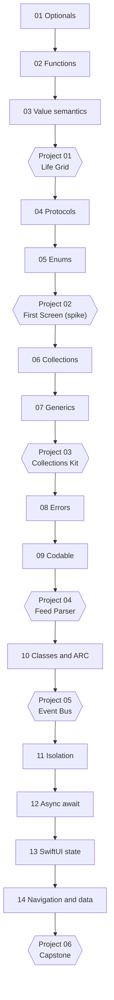

# Swift Academy

A ground up Swift curriculum for a working developer who has never written
Swift. Fourteen chapters, six projects, roughly 157 hours, ending with a signed
build of a real iOS app installed on your own device.

Every exercise ships as a stub plus a failing test. No solution to any exercise
exists on `main`. You type every line.

**Written so far: all fourteen chapters.** Every chapter ships its prose, its
probes, its exercise stubs, and its failing test suite, and all fourteen build
and test on the Command Line Tools. Only the `preview-app/` work in chapters
13 and 14 needs full Xcode and the simulator. Projects 01 and 05 ship their
failing test suites; the other four ship specs and scaffolds. This repository
is authored and worked through at the same time, so it is always partly built,
and [PROGRESS.md](PROGRESS.md) has a column for exactly this. Say so here
rather than let you find out at chapter 02.

- **Toolchain:** Apple Swift 6.2, Swift 6 language mode, strict concurrency on by default
- **Chapters:** 14, about 86 hours
- **Projects:** 6, the balance of the 157 hours
- **Pace:** about four months at ten hours a week

---

## Who this is for

You already write Python or C# professionally. You know types, generics,
collections, OOP, git, and the command line. You do not need a tour of what a
loop is.

What you need is the delta: where Swift's model differs from the one you
already carry, and why it made that choice. Every chapter is framed that way.
Exactly one anchor language per chapter (C# or Python, named in the chapter
front matter), and the comparison always comes after the Swift, never before,
so Swift is never encoded as a dialect of something else.

Four ideas in this course have no clean analogue in either language, and they
are the reason the course exists:

| Idea | Why your existing model misleads you |
|---|---|
| Value semantics | `struct` in C# is a near miss, and Python has nothing |
| Enums that carry payloads | Not an int, not a class hierarchy, exhaustive |
| Compile time isolation | `Sendable` and actors are checked, not conventions |
| `Optional<Wrapped>` as a real enum | Not a null check and not a nullable flag |

## Prerequisites

| Requirement | Detail |
|---|---|
| Language fluency | Python or C# at a working professional level |
| Fundamentals | Types, generics, collections, OOP, recursion, big O |
| Tooling | git, a terminal, an editor you are fast in |
| Hardware | An Apple silicon Mac |
| Swift | None assumed, and none expected |

Full detail in [PREREQUISITES.md](PREREQUISITES.md).

## Learning outcomes

By the end you can:

1. Model absence, failure, and domain state in the type system rather than in
   comments and conventions.
2. Predict copy versus share for any Swift type, and defend every `class` you
   write against the three reason checklist.
3. Design with protocols and constraints instead of inheritance, and choose
   `some` versus `any` for a stated reason.
4. Decode hostile JSON into strict domain types with typed errors.
5. Place isolation deliberately with `actor`, `@MainActor`, and `nonisolated`,
   and read any `Sendable` diagnostic the compiler emits.
6. Use `async let`, `TaskGroup`, and cooperative cancellation, and say precisely
   how that differs from a C# `Task`.
7. Build a SwiftUI app with a correct view identity model, value based
   `NavigationStack` routing, injected dependencies, and SwiftData persistence.
8. Ship a signed build to your own device.

---

## The path



All fourteen chapters run in the terminal with `swift test`, including the two
SwiftUI ones: SwiftUI and Observation ship in the macOS SDK, so chapter 13's
and chapter 14's exercise and test targets build and test with `xcode-select`
pointing at CommandLineTools. Verified on this toolchain. What needs Xcode and
a simulator is the throwaway preview app in each of those chapters, and the
app targets in projects 02 and 06.

Project 02 is the one deliberate exception in the sequence: a shallow SwiftUI
spike right after chapter 05, so you see a screen in the simulator in week
five instead of week thirteen.

## Roadmap

| # | Chapter | Hours | Outcome |
|---|---|---|---|
| 01 | Values, Types, and Optionals | 4 | Model absence in the type system and unwrap without a force unwrap |
| 02 | Functions, Argument Labels, and Closures | 5 | Read and write Swift call sites, pass functions as values, use trailing closures |
| 03 | Value Semantics and Mutation | 6 | Predict copy versus share for any Swift type, write `mutating` correctly, explain copy on write |
| 04 | Protocols and Extensions | 6 | Design with constraints instead of inheritance, conform to `Equatable`, `Hashable`, `Comparable`, extend types you do not own |
| 05 | Enums That Carry Data | 6 | Model domain state as an exhaustive enum and destructure it with `switch`, `if case`, and `guard case` |
| 06 | Collections and Transformations | 6 | Choose `Array`, `Dictionary`, or `Set` deliberately and chain `map`, `filter`, `reduce`, `compactMap`, including `lazy` |
| 07 | Generics, `some`, and `any` | 7 | Write generic types with constraints and pick `some` versus `any` for a stated reason |
| 08 | Errors, Typed Throws, and Result | 5 | Decide per API whether failure is `nil`, `throws(E)`, or `Result`, and defend the choice |
| 09 | Codable and the Data Boundary | 5 | Decode hostile JSON into strict domain types with custom keys, unknown case fallback, and typed errors |
| 10 | Reference Types, ARC, and Capture | 6 | Justify every class you write, break a retain cycle with a capture list, and prove deallocation with `deinit` |
| 11 | Sendable, Actors, and MainActor | 7 | Place isolation deliberately with `actor`, `@MainActor`, and `nonisolated`, and read any `Sendable` diagnostic |
| 12 | Structured Concurrency | 7 | Use `async let`, `TaskGroup`, and cooperative cancellation, and say how this differs from a C# `Task` |
| 13 | SwiftUI: Views, State, and Identity | 8 | Build a screen from a spec with correct modifier order, `State` and `Binding` ownership, and a correct view identity model |
| 14 | Navigation, Dependencies, and Persistence | 8 | Own app state in an `@Observable` `@MainActor` model, drive value based `NavigationStack` routing, inject dependencies, and persist with SwiftData |

Chapter hours total 86. The six projects total 71. That is the 157.

Each chapter owns exactly three core concepts, declared in its front matter. A
chapter's prose is capped at 1800 words. If a chapter would exceed that, it gets
split instead.

## Projects

Projects are separate packages. A project can be red for a week without turning
any chapter red.

| # | Project | After | Hours | What it forces |
|---|---|---|---|---|
| 01 | Life Grid | Ch 03 | 6 | A `Grid` struct with `subscript` and `mutating func step()`. The test copies the grid, mutates the original, and asserts the copy did not change, so a class cannot pass. |
| 02 | First Screen | Ch 05 | 5 | A spike, not mastery. One screen, `State`, a `List`, a button, one `NavigationStack` push, run in the iPhone 17 Pro simulator. Budgeted at five hours. No architecture, no networking, no persistence. |
| 03 | Collections Kit | Ch 07 | 8 | A `Deque` and an `LRUCache` conforming to `Sequence`, `Collection`, and `ExpressibleByArrayLiteral`. Tests iterate and use array literal init, so you supply associated types rather than consume them. Includes porting one structure you already wrote in C#. |
| 04 | Feed Parser | Ch 09 | 10 | `Codable` with `CodingKeys`, nested containers, unknown enum case fallback, typed decoding errors. Bundled fixtures, no network. Fixtures include a null, a missing key, two date formats, and an unknown enum case. |
| 05 | Event Bus | Ch 10 | 7 | ARC made observable. Weak storage, capture lists, `deinit`, class identity. The test asserts a subscriber deallocates after leaving scope, which fails on any strong capture implementation. |
| 06 | Capstone | Ch 14 | 35 | Everything, against a spec you write yourself before chapter 11 begins. Acceptance is a signed build installed on your own device. App Store submission is a stated post course goal, not a completion gate. |

---

## Progress

Tick a chapter when its `Done when` checklist is complete. Live status, plus the
running log and the single next action, lives in [PROGRESS.md](PROGRESS.md).

- [ ] 01 Values, Types, and Optionals
- [ ] 02 Functions, Argument Labels, and Closures
- [ ] 03 Value Semantics and Mutation
- [ ] Project 01 Life Grid
- [ ] 04 Protocols and Extensions
- [ ] 05 Enums That Carry Data
- [ ] Project 02 First Screen
- [ ] 06 Collections and Transformations
- [ ] 07 Generics, some, and any
- [ ] Project 03 Collections Kit
- [ ] 08 Errors, Typed Throws, and Result
- [ ] 09 Codable and the Data Boundary
- [ ] Project 04 Feed Parser
- [ ] 10 Reference Types, ARC, and Capture
- [ ] Project 05 Event Bus
- [ ] 11 Sendable, Actors, and MainActor
- [ ] 12 Structured Concurrency
- [ ] 13 SwiftUI: Views, State, and Identity
- [ ] 14 Navigation, Dependencies, and Persistence
- [ ] Project 06 Capstone

## Running the tests

All fourteen chapters live in one root package, so one command answers "does
chapter 03 still pass after I refactored".

```bash
swift test                            # every chapter
swift test --filter Chapter01Tests    # one chapter
make test                             # same as swift test
make test CH=01                       # same as the filter above
make next                             # print the next concrete action
make done CH=01                       # the chapter gate, then its checklist
make probe CH=01 P=predict            # run modules/01-optionals/probes/predict.swift
```

Filter on the test target name, `ChapterNNTests`, and never on the bare
number. Swift Testing matches the filter regex against a test ID that includes
the source line, so `swift test --filter 10` also runs two chapter 01 tests
that happen to be declared on lines containing 10. Measured on this toolchain:
`--filter 10` is 17 tests, `--filter Chapter10Tests` is the 15 that chapter 10
owns. `make test CH=10` builds the target name for you.

Projects and drills are their own packages:

```bash
swift test --package-path projects/01-life-grid
swift test --package-path drills
```

A stub returns a compiling wrong value with a `// TODO:` comment. Nothing calls
`fatalError`, because that aborts the whole parallel run with
`error: Exited with unexpected signal code 5` and no summary line, which
destroys the scoreboard. Instead you get a full red list that shrinks as you
work. Every exercise's test suite asserts at least two distinct expected values,
so no constant return can pass.

## Toolchain

| Item | Requirement |
|---|---|
| Swift | 6.2 (`swift --version` reports `swift-6.2-RELEASE`) |
| Language mode | Swift 6, the default at tools version 6.2 |
| Platform floor | `.macOS(.v14)`, declared in every manifest |
| Xcode | Not needed by any chapter. Needed for the preview apps in 13 and 14, and for the app targets in projects 02 and 06 |
| Simulator | iPhone 17 Pro |

Chapters 01 through 14 build and test on CommandLineTools alone. Before the
simulator work, point `xcode-select` at the full Xcode:

```bash
sudo xcode-select -s /Applications/Xcode.app/Contents/Developer
xcode-select -p
```

If you want the terminal chapters to stay on CommandLineTools, scope it per
command with `DEVELOPER_DIR` instead of switching globally. Full detail in
[SETUP.md](SETUP.md).

Two manifest rules that are easy to get wrong, and are settled in
[docs/how-this-repo-works.md](docs/how-this-repo-works.md):

- `platforms:` is mandatory. Omit it and Swift Testing macro expansion fails
  with `'isolation()' is only available in macOS 10.15 or newer`, which points
  nowhere useful.
- Never write `swiftLanguageMode(.v6)` or `-strict-concurrency=complete`. Both
  are defaults or Swift 5 migration flags, and stating them teaches that Swift 6
  concurrency is opt in. It is not.

`ExistentialAny` is enabled on every target, so every existential must be
spelled `any Protocol`. That turns the `some` versus `any` distinction from an
abstract lesson into a compiler enforced habit.

## Repo layout

```text
swift-academy/
├── PREREQUISITES.md   read before chapter 01
├── SETUP.md           ten minutes, mostly verification
├── docs/              specs, bridges, glossary, diagrams, policies
│   └── diagrams/      ARC and cycles, actor isolation, existentials
├── modules/           the fourteen chapters, NN-slug
│   └── NN-slug/
│       ├── README.md     the chapter
│       ├── exercises/    stubs you fill in
│       ├── tests/        the failing tests
│       └── probes/       runnable files the chapter links to
├── projects/          six standalone packages, each with a SPEC.md
├── drills/            one package of short retrieval drills
├── NOTES/             errors.md, append only
├── scripts/           verify-environment.sh, solutions.sh
├── .github/workflows/ one CI file, three jobs
├── Package.swift      one root package, 28 chapter targets
└── Makefile           test, next, done, probe, verify, solutions, clean
```

Everything a chapter needs sits inside that chapter's directory. There is no
parallel `solutions/` tree, no parallel `exercises/` tree, and no directory with
a space in its name.

Terminology is pinned, because the directory name and the prose name differ on
purpose:

| Term | Means |
|---|---|
| Chapter | A numbered unit under `modules/`. The directory keeps the name `modules` because one directory is one Swift module. |
| Exercise | A stub in a chapter's `exercises/`. |
| Drill | An entry in the `drills/` package. |
| Project | A directory under `projects/`. |

## Tutor, not author

This repository exists to be evidence. Evidence is worthless if the answers are
sitting next to the questions.

So: lesson prose contains complete, runnable, illustrative Swift that teaches a
concept. Exercise answers, project answers, and quiz answer keys are never
written into the repo on `main`. No lesson sample shares a function name, a
type name, a property name, or a signature with any exercise stub in any
chapter, so you can never solve an exercise by pattern matching against the
page above it.

Hints ship as progressive `<details>` folds in the chapter README, in three
steps: a nudge, then an approach, then the name of the API to go look up. Never
an implementation.

Where a project scaffold has to pre declare something for the package to
compile, the project's `SPEC.md` says so out loud rather than pretending the
tests pinned it.

### How locked solutions work

`main` holds stubs forever. Solutions live on a long lived `solutions` branch,
and each one lands there only after it has been solved on `main`.

The property that matters: for anything you have not solved yet, the answer does
not exist anywhere in this repository. Not in a folded block, not in an
encrypted file, not behind a rename. There is nothing for `grep`, a fuzzy
finder, or GitHub search to find, because it has not been written.

There is no `make peek` and no peek log. Reducing the friction to one command
with a self audited log is the honor system with extra steps, and `git show`
already exists.

For everyone else reading this repo later, the `solutions` branch is a complete
reference implementation of all fourteen chapters.

## The two journals

Exactly two files you maintain, both append only.

**[NOTES/errors.md](NOTES/errors.md)** takes every diagnostic that cost you more
than ten minutes: the verbatim compiler text, what you thought it meant, what it
actually meant. Swift's main difficulty for an experienced developer is
diagnostic literacy, and this is the highest yield retention artifact in the
repo. It is also the most credible proof that you wrote the code.

**The Log at the bottom of [PROGRESS.md](PROGRESS.md)** whose last line is
always the single next concrete action. The real failure mode is not a hard
chapter, it is a two week gap where reopening the repo costs twenty minutes of
figuring out where you were.

There is no third journal. That is deliberate.

## Comparison references

The per chapter `Coming from C#` or `Coming from Python` section is a slice, not
a summary. It carries only the rows that chapter owns, capped at 250 words, with
two mandatory subheads: where the analogy holds and where it breaks. At most two
rows in any chapter may cite the non anchor language.

The full mappings live in [docs/bridge.md](docs/bridge.md) for C# and
[docs/bridge-python.md](docs/bridge-python.md) for Python, and every chapter
links to its own one once. Eleven chapters anchor on C# and three (02, 06, and
09) anchor on Python; the assignment and the reason for each is
[docs/keywords.md](docs/keywords.md) section 2. Read a bridge when a
translation feels shaky across chapters. Read the chapter section when you
want the one comparison that matters right now.

| Document | Use it when |
|---|---|
| [docs/bridge.md](docs/bridge.md) | You want the full C# mapping in one place |
| [docs/bridge-python.md](docs/bridge-python.md) | You want the full Python mapping in one place |
| [docs/glossary.md](docs/glossary.md) | A Swift term appeared and you want the precise definition |
| [docs/keywords.md](docs/keywords.md) | You want to know which chapter owns a keyword, or which language it anchors on |
| [docs/reference.md](docs/reference.md) | You know the concept and want the syntax fast |
| [docs/legacy-swift.md](docs/legacy-swift.md) | A tutorial or codebase uses `ObservableObject`, `@Published`, `@StateObject`, GCD, or XCTest |
| [docs/core-data-literacy.md](docs/core-data-literacy.md) | An interviewer asks about Core Data, faults, or contexts |
| [docs/testing-policy.md](docs/testing-policy.md) | You want to know what the tests may and may not assert |
| [docs/shipping.md](docs/shipping.md) | You are signing and installing the capstone |
| [docs/interview-questions.md](docs/interview-questions.md) | You want to rehearse saying this material out loud |
| [docs/diagrams/](docs/diagrams/) | Cross cutting pictures: ARC and cycles, actor isolation, existentials |
| [docs/how-this-repo-works.md](docs/how-this-repo-works.md) | You are authoring a chapter, or a rule is in dispute |
| [docs/CURRICULUM-DESIGN.md](docs/CURRICULUM-DESIGN.md) | You want to know why the repo is shaped this way |
| [docs/ROADMAP-NEXT.md](docs/ROADMAP-NEXT.md) | You want the known gaps, prioritized, with effort estimates |

A note on the comparison sections generally: analogies are load bearing right up
until they are wrong, and the four ideas listed at the top of this file are
exactly where they go wrong. When the compiler contradicts an analogy, the
compiler is correct and the analogy gets retired. Put the diagnostic in
`NOTES/errors.md` and move on.

## Contributing

See [CONTRIBUTING.md](CONTRIBUTING.md). The style rules are binding, not
advisory: no dashes used as punctuation, second person, no paraphrased compiler
diagnostics, verbatim text only, and every code sample compiled on the toolchain
named in the chapter's `verified:` line before it ships.

## License

See [LICENSE](LICENSE).

**Last updated:** 2026-08-18 08:59 MDT
