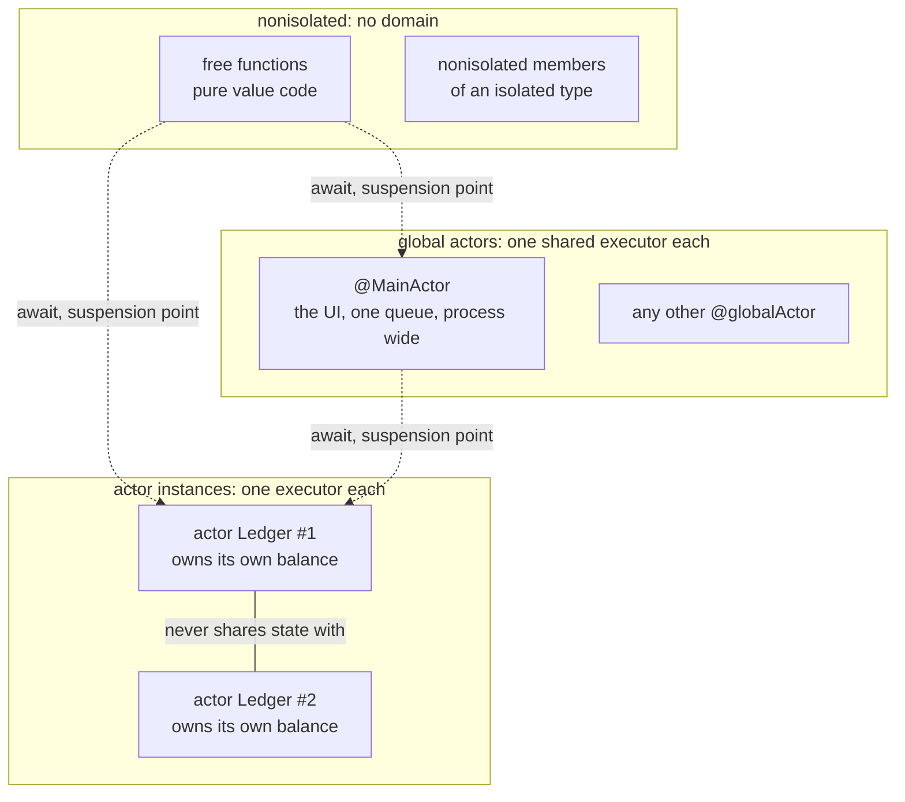

# Actor isolation

Cross cutting. Chapter
[11-isolation](../../modules/11-isolation/README.md) owns the teaching and
carries its own diagram. This file is the long version: the isolation domains
drawn as regions, and the four diagnostics you will actually meet, each one
reproduced on the toolchain in the front matter rather than recalled.

Everything on this page was produced by compiling a file. Where a claim has a
diagnostic under it, that diagnostic is the compiler's exact output.

## The three domains

Every declaration in a Swift 6 program sits in exactly one isolation domain.
That is a fact about the type system, with no timing behavior in it at all,
which is why chapter 11 comes before chapter 12.



Read three things off it.

**Two instances of the same actor type are two domains.** `Ledger #1` and
`Ledger #2` protect different state and never serialize against each other.
That is the difference between an actor and a lock: a lock is one object many
things queue on, an actor is one object protecting its own contents.

**Global actors are the exception, and `@MainActor` is the one that matters.**
Every `@MainActor` declaration in the whole process shares one executor. So
main actor isolation is the case the compiler diagnoses most reliably, which
is why teaching examples anchor there.

**`nonisolated` is not "safe" and not "background".** It is "belongs to no
domain", which means it may run anywhere and therefore may not touch anything
that belongs to a domain. Every dotted edge in the diagram is an `await` and a
possible suspension.

## Crossing a boundary: what the compiler checks

```text
   nonisolated                     @MainActor
   +---------------------+         +---------------------+
   | func report(...)    |         | final class Screen  |
   |                     |         |   var total: Int    |
   |   s.total  ---------|-------->|                     |
   |            ^        |         +---------------------+
   +------------|--------+
                |
                +-- no await, no isolation: rejected at compile time
```

Verified:

```swift
@MainActor final class Screen { var total = 0 }
func report(_ s: Screen) -> Int { s.total }
```

```text
error: main actor-isolated property 'total' can not be referenced from a nonisolated context
note: add '@MainActor' to make global function 'report' part of global actor 'MainActor'
```

The same shape for an actor instance:

```swift
actor Ledger {
    private var balance = 0
    func deposit(_ n: Int) { balance += n }
}
func run(_ l: Ledger) { l.deposit(5) }
```

```text
error: call to actor-isolated instance method 'deposit' in a synchronous nonisolated context [#ActorIsolatedCall]
note: calls to instance method 'deposit' from outside of its actor context are implicitly asynchronous
```

The note is the lesson. An actor's method is not a method with a lock in it.
From outside the actor it is an `async` method, because reaching it means
suspending until the actor is free. That is a signature change, visible at
every call site, which is the property `lock` never had.

## Regions, which is the part everyone gets wrong

**Do not teach the rule that a non `Sendable` value cannot cross an isolation
boundary.** It is false, the compiler will contradict it within a week, and
trust in the material is the one thing that cannot be repaired.

The real rule is about **regions**. The compiler tracks which values could
still be reachable from the current context. A value may be *sent* across a
boundary as long as the sending side provably stops using it.

The same call, twice, differing only in whether the local is touched
afterwards.

```text
Case A: the region is transferred. Compiles clean.

   let b = Box()          region: { b } is local
   await s.take(b)        region { b } handed to the actor
                          nothing here can reach b any more
   <end of function>

Case B: the region is shared. Rejected.

   let b = Box()          region: { b } is local
   await s.take(b)        region { b } handed to the actor
   _ = b.n                and read here, concurrently
                          ^ two domains can now reach one region
```

Verified, case A:

```swift
func hand(_ s: Store) async {
    let b = Box()
    await s.take(b)
}
```

Compiles with no diagnostic.

Verified, case B:

```swift
func hand(_ s: Store, _ b: Box) async { await s.take(b); _ = b.n }
```

```text
error: sending 'b' risks causing data races [#SendingRisksDataRace]
note: sending task-isolated 'b' to actor-isolated instance method 'take' risks
causing data races between actor-isolated and task-isolated uses
```

The closure form of the same thing, which is the one you will actually hit:

```swift
final class Counter { var n = 0 }
func demo() async {
    let c = Counter()
    Task { c.n += 1 }        // clean on its own
    print(c.n)               // this line is what creates the error
}
```

```text
error: sending value of non-Sendable type '() async -> ()' risks causing data races [#SendingRisksDataRace]
note: access can happen concurrently
```

Delete the `print` and the identical `Task` compiles. The `Task` was never the
problem; the second reachable use was.

## The callout: build, do not trust the squiggles

These diagnostics come from a SIL pass that runs during full compilation, not
during type checking.

Verified, on the case B file above:

| Command | Output |
|---|---|
| `swiftc -swift-version 6 -typecheck iso.swift` | nothing at all |
| `swiftc -swift-version 6 -c iso.swift` | the `[#SendingRisksDataRace]` error above |

So an editor that only type checks will show you a clean file that
`swift build` rejects. `swift build` is the source of truth. This is worth
knowing before it costs you an hour of believing the editor.

## What Swift 6 does not do

It does not catch every shared mutable state mistake, and any material that
says it does will be contradicted by the compiler.

What it reliably catches is captured state crossing a declared boundary. What
it does not: a logic race between two correctly isolated operations, an actor
reentrancy bug where state changed across an `await` inside a single method,
anything behind an `@unchecked Sendable` you asserted, and anything in C or
Objective C.

`@unchecked Sendable` deserves its own line. It is a promise you made to the
compiler that it cannot verify, and it is the exact point where the type
system stops helping. Write it only over a type whose safety is enforced by
something else you can name, and write the name in a comment on the same line.

## Vocabulary, one line each

| Term | One line |
|---|---|
| Isolation domain | The set of declarations that serialize against each other. |
| `actor` | A type whose stored properties are isolated to its own instance. |
| Global actor | An isolation domain shared process wide. `@MainActor` is one. |
| `nonisolated` | Belongs to no domain, so it may not touch isolated state. |
| `Sendable` | A type safe to reference from more than one domain. |
| `sending` | A parameter whose region is transferred to the callee. |
| Region | The set of values that could still reach each other from here. |
| Suspension point | Every `await`. State may change across it. |
| Reentrancy | Another call may enter the actor while yours is suspended. |

---

Related: [existentials.md](existentials.md),
[arc-and-cycles.md](arc-and-cycles.md), [../glossary.md](../glossary.md),
and chapters [11-isolation](../../modules/11-isolation/README.md) and
[12-async-await](../../modules/12-async-await/README.md).
