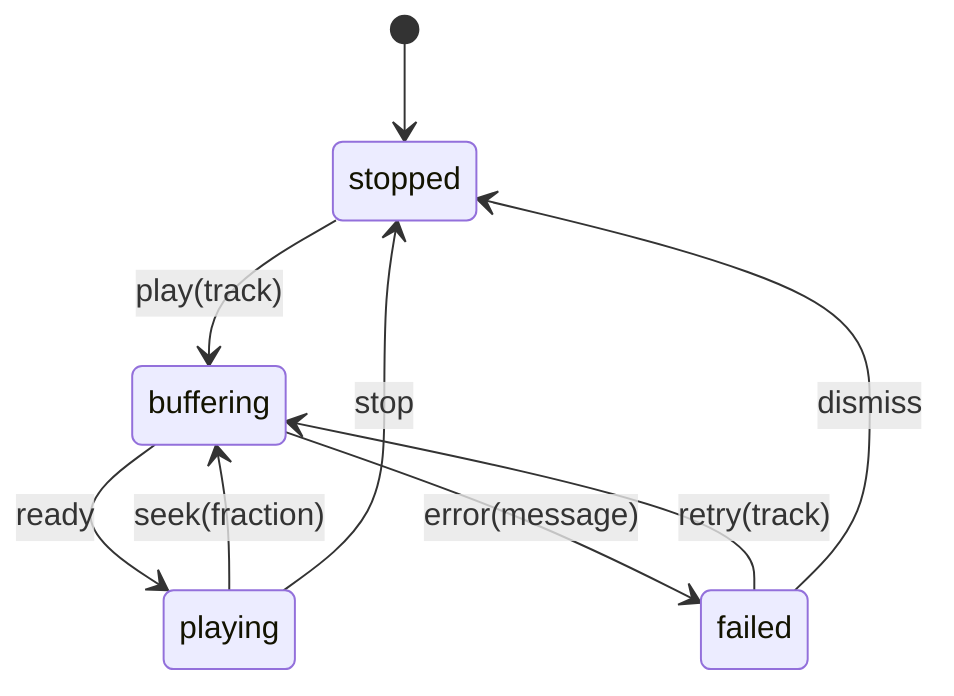

# 05. Enums That Carry Data

## Cold open

Blank file, no notes: re-solve your chapter 03 drill on copy on write before
you read anything below.

```bash
swift test --package-path drills --filter Ch03
```

## The question

A parcel is waiting, moving, delivered, or lost. Four situations, and each
one carries different facts: a carrier and an estimate while it moves, a
signature when it lands, a reason when it does not. Most languages offer one
tool for that, a record with every field made optional, plus a comment saying
which combinations are real. The compiler never reads the comment. Four
optional fields hold sixteen shapes and mean four of them, so every function
that touches the record defends against the other twelve, and every new
reader has to rediscover which twelve those are. The question is whether a
type can be told the answer once.

## Swift's answer

A Swift enum is a sum type. A value is exactly one of its cases, and each
case declares the data that case needs.

```swift
enum Player {
    case stopped
    case buffering(track: String, fraction: Double)
    case playing(track: String)
    case failed(message: String)
}
```

`fraction` is not a property of `Player`. It is an argument to one case, and
the only way to reach it is to prove which case you are holding. `switch`
does that, and over an enum you own it is exhaustive with no `default`.

```swift
func headline(_ player: Player) -> String {
    switch player {
    case .stopped: "nothing playing"
    case .buffering(let track, let fraction): "buffering \(track) \(fraction)"
    case .playing(let track): "playing \(track)"
    case .failed(let message): "stopped: \(message)"
    }
}
```

Leave a case out and it does not compile, and the note writes the missing
pattern for you. That is the whole payoff. Add a fifth case a year from now
and the compiler hands you the list of every place that has to decide what
to do about it. A `default` arm buys silence today and pays for it then, so
never write one over an enum you own. Reach for it only over an enum you do
not control, where a new case can arrive without your build breaking.

Raw values are a different feature that shares the keyword. A raw value is
one compile time constant per case, so the mapping is total going out and
failable coming in.

```swift
enum Band: Int, CaseIterable {
    case low = 2, mid = 5, high = 8
}
Band.high.rawValue          // 8
Band(rawValue: 6)           // nil, and the type is Band?
Band.allCases               // low, mid, high, in declaration order
```

A case cannot have both, because a raw value is fixed at the declaration and
a payload varies per instance. `CaseIterable` needs the same thing raw values
need: cases it can build with no arguments.

Matching is a family, not one statement. Each form states a different control
flow contract, exactly as the optional forms did in chapter 01.

| Form | What it does | When it is the right one |
|---|---|---|
| `switch` | every case, compiler checked | more than two outcomes |
| `case let .playing(t)` | hoists the `let` when all bindings are lets | pure destructuring |
| `case .x(let n) where n > 3` | filters after binding, first match wins | one case splits in two |
| `if case .failed = x { }` | one case, no exhaustiveness | you care about one shape |
| `guard case .playing(let t) = x else { }` | binds for the rest of the scope | any other case means stop |
| `for case .x(let n) in items` | matches while iterating | filtering a heterogeneous array |
| `switch (state, event)` | matches a tuple, both halves at once | a transition table |

Patterns nest, because payloads are ordinary values and `Optional` is an
ordinary enum: `case .delivered(let day, .some(let name))` matches a
delivery that was signed for and binds both halves in one line. Every form
above is running in `probes/matching.swift`.

Recursion needs one keyword. A case that stores the enum inside itself makes
the size of the enum depend on the size of the enum, so `indirect` boxes that
payload and breaks the cycle.

```swift
indirect enum Filter {
    case tag(String)
    case not(Filter)
    case any([Filter])
}
```

## Predict

Write your prediction in the comment above each snippet in
`probes/predict.swift`, then run `make probe CH=05 P=predict`. The ones you
get wrong are each a place where a case is a function, a pattern is not a
condition, or a raw value is not an index.

```swift
enum Pulse { case quiet; case beat(Int) }
let maker = Pulse.beat
print(type(of: maker), type(of: maker(3)))     // 1

enum Step: Int, CaseIterable { case first = 1; case third = 3; case fourth }
print(Step.allCases.count, Step.fourth.rawValue, Step(rawValue: 2) as Any)  // 2
```

## Coming from C#

### Where the analogy holds

| C# | Swift | Note |
|---|---|---|
| `enum Suit { Hearts }` | `enum Suit { case hearts }` | both name a closed set |
| `(int)Suit.Hearts` | `Suit.hearts.rawValue` | both expose an underlying value |
| `switch` expression arms | `switch` cases | C# 8 patterns are the same shape |
| a sealed hierarchy of records | one case per variant | both attach data to a variant |

### Where it breaks

```csharp
enum Suit { Hearts, Spades }
Suit s = (Suit)99;              // compiles, runs, prints "99"
```

```python
class Phase(enum.Enum):
    idle = enum.auto()
    busy = enum.auto()

match phase:
    case Phase.idle: ...        # no arm for busy, and nothing says so
    case Phase.idel: ...        # AttributeError, but only if reached
```

| Claim | C# | Swift |
|---|---|---|
| a value outside the case list | any `int` casts in | no such value exists |
| payload per instance | needs a sealed record hierarchy | `case playing(track: String)` |
| exhaustiveness | warning only, constants only | an error, and it counts payloads |
| Python `match` plus `enum.Enum` | (row applies to Python) | patterns match, members hold no payload |
| Python exhaustiveness | (row applies to Python) | `match` checks nothing, so a member with no arm falls through `case _` |

C# has no discriminated union, so a four state model becomes four nullable
fields plus a comment, or a sealed record hierarchy that gets you the
payloads without the exhaustive switch. Python 3.10 got closer: `match` has
class patterns, capture patterns, and guards, and it reads almost like this
chapter. It stops one step short. Nothing checks that you covered the
members, a misspelled member raises only when its arm is reached, and an
`enum.Enum` member is a singleton constant, so per instance data has to live
somewhere else.

Full row set: [docs/bridge.md](../../docs/bridge.md).

## The model



Four states, eight transitions, and no other value of type `Player` exists.
The bag of optionals version of the same feature holds sixteen shapes:
`make probe CH=05 P=states` counts them and prints a sample of the twelve that
mean nothing. The payload travels with the state, so `fraction` is reachable only
inside the `.buffering` arm. No code outside that arm can read it and no code
inside it has to ask whether it is there.

## Where it goes wrong

Every row was produced by `make probe CH=05 P=errors`, which holds twelve
blocks. These are the eight worth memorising.

| Diagnostic | What it means | Fix |
|---|---|---|
| `error: switch must be exhaustive` with `note: add missing case: '.iris(radius: let radius, blades: let blades)'` | you left a case out, and the note is the pattern you need | paste the note in, then decide what that case does |
| `error: switch must be exhaustive` with `note: add missing case: '.low(_)'` | a `where` clause narrows a case, so the compiler stops counting it as covered | add an unguarded arm for the same case |
| `error: value of type 'Hatch' has no member 'gap'` | a payload label names an argument, not a stored property | match the case and bind the payload |
| `error: member 'filled' expects argument of type 'String'` | a case with a payload is a function, and you named it without calling it | `.filled("text")`, or match instead of construct |
| `error: cannot find 'symbol' in scope` | a bare name in a pattern is matched against, not bound | write `let symbol` inside the pattern |
| `error: enum with raw type cannot have cases with arguments` | raw values and payloads are exclusive | drop the raw type, or move the data into a payload |
| `error: recursive enum 'Segment' is not marked 'indirect'` | the case stores the enum, so its size depends on itself | `indirect enum`, or `indirect case` on that one |
| `error: binary operator '==' cannot be applied to two 'Gauge' operands` | equality is synthesized for payload free enums only | declare `: Equatable` once every payload is |

## Exercises

Stubs are in `exercises/Enums.swift`, in the order below. Run
`swift test --filter Chapter05Tests`.

1. `scaleFactor(forSymbol:)` turns a prefix symbol into its multiplier, and
   nil for anything that is not one.
2. `symbols(upTo:)` lists prefix symbols in declaration order, up to and
   including the one you name.
3. `statusLine(for:)` writes one line of customer text per `Shipment` case,
   with a singular day, an arrival today, and an unsigned delivery.
4. `totalPaid(in:)` nets payments against refunds across a statement and
   ignores lines that moved no money.
5. `evaluate(_:)` walks an `indirect enum Expression` and returns its value.
6. `advance(_:on:)` is the integrative one: a transition table over a state
   and an event, where every pair the table does not name leaves the state
   alone.

<details><summary>Hint 1, a nudge</summary>

Exercise 6 is a table, not a decision tree. Match the state and the event
together in one `switch` and let the compiler tell you which combinations you
have not written down.
</details>

<details><summary>Hint 2, an approach</summary>

Five rows do something and the rest do nothing. Write the five first, in any
order that reads well, then one last arm for everything else. Decide where
the retry limit belongs: in the pattern, or in the body of the arm.
</details>

<details><summary>Hint 3, the API to look up</summary>

Tuple patterns, `where` clauses, and the fact that a bare `let` in a pattern
matches anything and binds it. All three are running in
`probes/matching.swift`, sections 3 and 5.
</details>

## Retrieval checkpoint

Answer in writing first, then check the four runnable ones with Swift.
Nothing here has a committed answer.

1. `MemoryLayout<Player>.size`. Predict it before you run it, then predict
   what it becomes if you add a case carrying one more `String`.
2. Write an enum where `case a` and `case b` both carry an `Int`. Predict
   whether `.a(1) == .b(1)` compiles, and what it prints if it does.
3. Take a `switch` over four cases and add a fifth case to the enum. Count
   the errors you get, and say which of them you would have wanted.
4. `if case .some(let x) = optionalInt` and `if let x = optionalInt`. Predict
   whether both compile, and explain what that says about chapter 01.
5. Judgment, no single right answer. You are decoding a status field from a
   server you do not own. Argue for a closed enum that fails to decode an
   unknown value, and then for one carrying an `unknown(String)` case. Say
   what each choice costs you six months later.

## Stretch

Not required to advance. Skipping all of it costs you nothing.

- Read SE-0155, "Normalize Enum Case Representation", in
  <https://github.com/swiftlang/swift-evolution/tree/main/proposals>. It is
  the argument for why a case payload is a tuple and then why it is not.
- Add a `.divide` case to `Expression` in a scratch file and watch which of
  your own functions the compiler reopens.
- Model one screen of an app you have shipped as a single enum, then count
  the `if` statements it deleted.

## Done when

- [ ] `swift test --filter Chapter05Tests` is green
- [ ] Every diagnostic that cost more than ten minutes is in `NOTES/errors.md`
- [ ] I contributed this chapter's four drills to `drills/`
- [ ] I can explain the three concepts in the front matter out loud, no notes
- [ ] No `default` survives in my solutions:
      `grep -n 'default' modules/05-enums/exercises/*.swift` prints nothing

This chapter does not cover what happens when the case list is not yours to
close: decoding an enum from JSON, and keeping the raw value of a case you
have never heard of. That is chapter 09.
