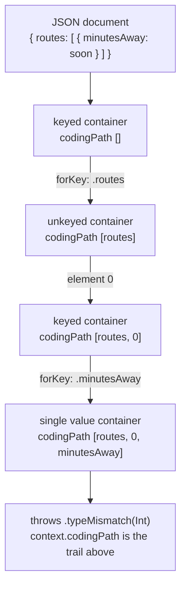

# 09. Codable and the Data Boundary

## Cold open

Blank file, no notes: re-solve your chapter 07 drill on `some` versus `any`
before you read anything below.

```bash
swift test --package-path drills --filter Ch07
```

## The question

Bytes that arrive from outside your process carry no type. Somebody has to
decide whether they hold what you assumed, and the only real design question
is where that happens and what it produces. Python's answer is that it never
quite happens: `json.loads` hands back nested dictionaries, every field access
is an unchecked bet, and the bet is settled at the point of use, arbitrarily
far from the parse and usually in front of a user. The alternative is to spend
one line: the document becomes a type or it becomes an error, right there.
Everything after that line is ordinary Swift with no defensive reads in it.

## Swift's answer

`Codable` is `Encodable & Decodable`, and the compiler writes both
conformances for you when every stored property is itself `Codable` and you
declare the conformance. Nothing is reflective and no conformance is computed
at runtime: this is code generated at compile time from your stored
properties.

```swift
struct Show: Codable, Equatable {
    var title: String
    var episodeCount: Int
}

let payload = Data(#"{"title":"Signals","episodeCount":12}"#.utf8)
let show = try JSONDecoder().decode(Show.self, from: payload)
```

Synthesis stops the moment the document stops agreeing with your property
names, which is immediately, because the server was not written for you.
`CodingKeys` is the correction: a nested enum with `String` raw values that
maps each property to the name on the wire. It replaces the synthesized key
set rather than extending it, so every property you still want has to appear.

```swift
struct Segment: Codable, Equatable {
    var title: String
    var seconds: Int

    enum CodingKeys: String, CodingKey {
        case title
        case seconds = "duration_s"
    }
}
```

When the shapes disagree rather than the names, you write the initializer
yourself. A `Decoder` hands out three kinds of container and they correspond
exactly to the three things JSON can be at any position: a keyed container is
an object, an unkeyed container is an array, a single value container is one
scalar. Containers nest, so a document nested four deep is four calls, and
none of it requires a Swift type per level.

```swift
struct Episode: Decodable, Equatable {
    var title: String
    var seconds: Int
    var tagCount: Int

    enum CodingKeys: String, CodingKey {
        case title
        case seconds = "duration_s"
        case tags
    }

    init(from decoder: any Decoder) throws {
        let root = try decoder.container(keyedBy: CodingKeys.self)
        title = try root.decode(String.self, forKey: .title)
        seconds = try root.decode(Int.self, forKey: .seconds)

        var tags = try root.nestedUnkeyedContainer(forKey: .tags)
        var counted = 0
        while !tags.isAtEnd {
            _ = try tags.decode(String.self)
            counted += 1
        }
        tagCount = counted
    }
}
```

Optional is where this gets subtle, because JSON has three states and Swift
has two. A key can be absent, present holding `null`, or present holding a
value, and five calls on the same container disagree about which of those are
the same thing. Verified with `make probe CH=09 P=threeway`.

| You call | Key absent | Key holds null |
|---|---|---|
| `decode(Int.self, forKey:)` | throws `.keyNotFound` | throws `.valueNotFound` |
| `decode(Int?.self, forKey:)` | throws `.keyNotFound` | returns nil |
| `decodeIfPresent(Int.self, forKey:)` | returns nil | returns nil |
| `contains(.key)` | false | true |
| `decodeNil(forKey:)` | throws | true |

Only one row treats absent and null as the same, and that row is the one a
synthesized conformance uses for every optional property, which is why they
usually collapse and why that is usually right. When it is not right,
`contains` and `decodeNil` are how you keep the two apart, and the answer is
an enum of your own rather than an `Int?`.

Two settings on the decoder replace a great deal of per type work.
`keyDecodingStrategy = .convertFromSnakeCase` transforms every key in the
document before it is matched, and `dateDecodingStrategy = .iso8601` turns
timestamps into `Date`. The strategy runs first and the transformed key is
then matched against your `CodingKeys` raw values, which is a sharper rule
than it sounds like and is worth reading twice.

## Predict

Write your prediction on the `PREDICTION` line above each snippet in
`probes/predict.swift`, then run `make probe CH=09 P=predict`. The toolchain
is the answer key and this repository has none.

```swift
struct Marker: Codable { var at: Date }
try encoder.encode(Marker(at: Date(timeIntervalSince1970: 0)))       // probe 1

let byGate: [Gate: String] = [.north: "open"]
try encoder.encode(byGate)                                           // probe 2

try decoder.decode(Count.self, from: Data(#"{"n": 261.0}"#.utf8))    // probe 4
```

## Coming from Python

### Where the analogy holds

| Python | Swift | Note |
|---|---|---|
| `json.loads(raw)` | `try JSONDecoder().decode(T.self, from: data)` | both take bytes and produce a value |
| pydantic's field alias | `CodingKeys` with a raw value | both rename declaratively |
| a validator that fills a default | `decodeIfPresent(_:forKey:) ?? default` | both are per field |
| `json.dumps` | `try JSONEncoder().encode(value)` | both go back out |

### Where it breaks

```python
def read_show(raw: str) -> str:
    payload = json.loads(raw)
    return payload["shows"][0]["title"].upper()
```

The failure is a `KeyError`, an `IndexError`, or an `AttributeError` on
`None`, raised at the line that used the field. The Swift version fails at the
`decode` call with a `DecodingError` naming `shows/0/title` and the type it
expected, and every line after it is total.

| Claim | Python | Swift |
|---|---|---|
| when the shape is checked | never, or at the first use of each field | once, at one line you can point at |
| what a bad document produces | an exception of the day, from the point of use | a `DecodingError` with a coding path |
| an unknown payload | natural, you keep the dict | only as a type you write, such as a recursive `JSONValue` enum |
| C# by comparison | (row applies to C#) | `[JsonPropertyName]` annotates one property; `CodingKeys` replaces the whole key set |

pydantic is the near miss worth naming. It validates at construction like
Swift does, but the model is a runtime object graph, the checking is a library
you added, and `model_config` decides at runtime what an extra key means. In
Swift the checking is the compiler's output, not a dependency, and an extra
key is ignored by construction because nothing asked for it.

Full row set: [docs/bridge-python.md](../../docs/bridge-python.md).

## The model



The decoder walks down and the coding path is the trail it leaves. That trail
is the whole value of a typed decoding error: it names the position in the
document rather than the line in your program, so a failure three levels into
an array tells you which element. `make probe CH=09 P=failures` prints five
real ones. Note what `localizedDescription` does to each of them.

## Where it goes wrong

Every row was produced by `make probe CH=09 P=errors`. The error line for a
failed synthesis is nearly always the same sentence, so the note under it is
quoted here as well: the note is the diagnosis.

| Diagnostic | What it means | Fix |
|---|---|---|
| `error: type 'Promo' does not conform to protocol 'Decodable'` with `note: cannot automatically synthesize 'Decodable' because 'Runtime' does not conform to 'Decodable'` | synthesis is recursive, and one part of the type cannot be decoded | conform the named part, or write `init(from:)` |
| `note: cannot automatically synthesize 'Decodable' because 'episodeCount' does not have a matching CodingKey and does not have a default value` | your `CodingKeys` replaced the key set and dropped a property | add the case, or give the property a default |
| `note: cannot automatically synthesize 'Decodable' because 'CodingKeys' does not conform to CodingKey` | the name is not what makes it work, the conformance is | write `enum CodingKeys: String, CodingKey` |
| `warning: immutable property will not be decoded because it is declared with an initial value which cannot be overwritten` | a `let` with a value is already decided, so the decoder skips it and you get the literal back | make it `var`, or drop the initial value |
| `error: type 'any Item' cannot conform to 'Decodable' [#ProtocolTypeNonConformance]` | decoding picks an `init(from:)`, and an existential has no single one | decode a concrete enum that switches on a discriminator field |
| `error: cannot find 'CodingKeys' in scope` | `CodingKeys` is generated as part of a synthesized conformance, and you wrote `init(from:)` so nothing was synthesized | declare the enum yourself |
| `error: value of optional type 'Int?' must be unwrapped to a value of type 'Int'` | `decodeIfPresent` answers a two answer question, so its result is optional whatever the property is | `?? default`, or make the property optional |
| `error: extra argument 'forKey' in call` | a single value container holds one scalar and has no keys | use `decoder.container(keyedBy:)` for an object |

## Exercises

Stubs are in `exercises/Codable.swift`, in the order below. Run
`swift test --filter Chapter09Tests`.

1. `Departure` decodes and encodes a board whose keys are `route_id` and
   `minutes_away`, without renaming your properties.
2. `ServiceLevel` decodes a value the operator invented this morning as
   `.unrecognized` instead of failing the document.
3. `StopSnapshot` flattens two nested objects into one flat value, and
   declares no type for either nesting.
4. `SensorSample` keeps absent, null, and present apart in a
   `BatteryReading`, which `Int?` cannot do.
5. `makeArrivalDecoder()` reads snake case keys and RFC 3339 timestamps.
   Exactly one property still needs help afterwards.
6. `describeFailure(decoding:)` turns a `DecodingError` into one line naming
   the kind and the coding path. This is the integrative one.

<details><summary>Hint 1, a nudge</summary>

Exercise 5 fails on one property and decodes the other two. Print the error
before changing anything: it names the key it looked for, and that name is
not the key in the document and not the name of your property either.
</details>

<details><summary>Hint 2, an approach</summary>

Exercise 6 has two independent halves: choosing the sentence from the kind of
error, and building the path from `context.codingPath`. Write the path half
first as its own function and print it for all five failures in
`probes/failures.swift` before wiring it up.
</details>

<details><summary>Hint 3, the API to look up</summary>

`CodingKey` has two properties, and one of them is the reason an array index
does not print as a number by default. For exercise 5, read the
`keyDecodingStrategy` documentation on what `.convertFromSnakeCase` does to
`stop_id`, then compare it to how you spelled the property.
</details>

## Retrieval checkpoint

Answer in writing first, then check the runnable ones with Swift. Nothing
here has a committed answer.

1. A property is `var note: String?` and the key is absent. What does the
   synthesized `init(from:)` do, and what would `decode(String.self,
   forKey:)` have done instead?
2. You add a case to `CodingKeys` that no property matches. Predict whether
   that is an error, a warning, or silent, then try it.
3. `dateDecodingStrategy` is `.iso8601` and one row carries fractional
   seconds. Predict whether it decodes on this toolchain before you run it.
4. Which of `.keyNotFound`, `.typeMismatch`, `.valueNotFound`, and
   `.dataCorrupted` can carry a non empty `codingPath`? Find a document that
   produces each.
5. Judgment, no single right answer. An operator adds a field you do not
   model. Argue whether decoding should ignore it or fail, then argue the
   same question for a field whose type changed. Say what the option you
   rejected costs the person on call at 3am.

## Stretch

Not required to advance. Skipping all of it costs you nothing.

- Decode a heterogeneous array: an enum with one case per shape, decoded by
  reading a discriminator key first, then a nested payload.
- Write `encode(to:)` for `SensorSample` so that a round trip preserves all
  three battery states, and decide what null means on the way out.
- Read SE-0295, "Codable synthesis for enums with associated values", in
  <https://github.com/swiftlang/swift-evolution/tree/main/proposals>, then
  predict the JSON shape it generates before encoding one.

## Done when

- [ ] `swift test --filter Chapter09Tests` is green
- [ ] Every diagnostic that cost more than ten minutes is in `NOTES/errors.md`
- [ ] I contributed this chapter's four drills to `drills/`
- [ ] I can explain the three concepts in the front matter out loud, no notes
- [ ] No solution decodes into a dictionary and reads fields out of it:
      `grep -n 'String: Any' modules/09-codable/exercises/*.swift` prints nothing

This chapter never touches the network, and neither does project 04. Where
the bytes come from is chapter 12's question, and the failure they arrive with
is chapter 08's.
