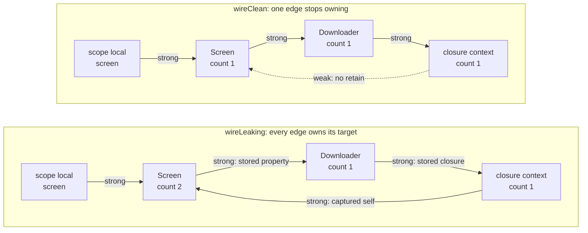

# 10. Reference Types, ARC, and Capture

## Cold open

Blank file, no notes: re-solve your chapter 08 drill on `throws(E)` before
you read anything below.

```bash
swift test --package-path drills --filter Ch08
```

## The question

You have written nine chapters of working Swift without one `class`. That was
not asceticism. A type with identity forces a language to answer two questions
a value never raises: who else can see my mutation, and who deletes the
object. C# answers both with the runtime, uniformly, for every type. Swift
answers the first by making copies the default, so most of your types never
ask it. Where identity is genuinely required, the second answer stops being
the runtime's job and becomes part of the code you write. That trade has a
bill, and this chapter is the bill.

## Swift's answer

Equality is a claim about values. Identity is a claim about storage. Swift
keeps them as separate operators, and `===` is defined only on `AnyObject`,
so it does not compile for a struct.

```swift
struct Ticket: Equatable { let seat: String }
final class Booking { let seat: String; init(seat: String) { self.seat = seat } }

print(Ticket(seat: "4A") == Ticket(seat: "4A"))       // true, same value
let mine = Booking(seat: "4A")
let alias = mine
print(mine === alias, mine === Booking(seat: "4A"))   // true false
```

`alias` is a second name for one object. That is the entire reason `class`
exists and the entire hazard: a mutation through `alias` is visible through
`mine`, including when both are `let`, because `let` binds the reference and
not the object behind it.

ARC is how the object dies. The compiler inserts a retain wherever a strong
reference is formed and a release wherever one goes away, and the object
deallocates the instant the count reaches zero. Nothing scans and nothing
defers, so `deinit` runs at a point you can predict from the source.

```swift
final class Socket {
    let host: String
    init(host: String) { self.host = host; print("open \(host)") }
    deinit { print("close \(host)") }
}

func work() {
    let socket = Socket(host: "db")
    print("using \(socket.host)")
}       // "close db" prints here, at this brace, every run
```

That determinism is what makes `deinit` a place for real cleanup, and it is
why the failure below is a correctness bug rather than a memory statistic.
Closures capture strongly by default, so an object storing a closure that
refers back to itself holds itself alive forever.

```swift
final class Screen {
    let downloader = Downloader()
    private(set) var lastPayload = ""

    func wireLeaking() {
        downloader.onFinish = { payload in self.lastPayload = payload }
    }
}
```

The screen owns the downloader, the downloader owns the closure, and the
closure owns the screen. Three ordinary edges, one loop, and nothing in it
ever reaches zero.

The fix is one capture list, on exactly one edge. It is not on this page on
purpose: run both versions and read which one prints its `deinit` lines.

```bash
make probe CH=10 P=cycle
```

`unowned` is the other way to stop owning. Not a faster `weak`, a promise: the
referent outlives this reference, so there is no nil state and no Optional.
Make it only when the graph guarantees it, as below, where the card is created
by the customer and unreachable without one.

```swift
final class Customer {
    var card: Card?
    deinit { print("customer gone") }
}

final class Card {
    unowned let owner: Customer          // never nil while this card exists
    init(owner: Customer) { self.owner = owner }
}
```

Break the promise and you do not get nil, you get a dead process. Reach for
`weak` whenever the referent may plausibly die first: a delegate, an observer
registry, a back edge you did not design. The two spellings drawn side by side
at the moment of death are in
[docs/diagrams/arc-and-cycles.md](../../docs/diagrams/arc-and-cycles.md).

Write `class` only for one of three stated reasons: an observable lifecycle
so `deinit` must run, two references that must see the same mutation, or
inheritance and Objective C interop. "It felt natural" is a C# reflex.

## Predict

Write your answer in the comment above each `print`, then run the file. The
toolchain is the answer key and no answers live in this repo.

```swift
let fixed = Meter(label: "fixed"); let alias = fixed
alias.reading = 7
print(fixed.reading, fixed === alias)      // 1

var pending = 1
let snapshot = { [pending] in pending }
let live = { pending }
pending = 99
print(snapshot(), live())                  // 2
```

Snippet 3 builds two `Ring` objects that point at each other and asks which
`deinit` lines print, and snippet 4 changes exactly one edge of it. Both live
in the probe, because a ring needs its own function to go out of scope in.

```bash
make probe CH=10 P=predict
```

## Coming from C#

### Where the analogy holds

| C# | Swift | Note |
|---|---|---|
| `class`, heap, aliasing | `class`, heap, aliasing | Same semantics, same bugs. Swift only changes how often you opt in. |
| `Object.ReferenceEquals(a, b)` | `a === b` | Operator instead of a static call, and it refuses to compile on a value type. |
| `readonly` field of class type | `let` on a class reference | Both bind the reference. The object behind it stays mutable. |

### Where it breaks

| C# or Python | Swift | Why the reasoning differs |
|---|---|---|
| finalizer `~Foo()` | `deinit` | A finalizer runs whenever the collector decides, possibly never. `deinit` runs the instant the last strong reference drops. |
| the GC collects cycles | ARC never collects a cycle | Tracing asks "can I reach this". ARC asks "does anyone hold this". Those agree on every graph except a loop. |
| `WeakReference<T>` plus `TryGetTarget` | `weak var x: T?` | A language feature, not a wrapper. It zeroes itself, so reading it is an ordinary Optional. |
| Python: `gc` reclaims cycles behind you | no collector at all | CPython refcounts like Swift, so the intuition carries everywhere except the one place that leaks. |

This is a correct C# program, and its author never had to think about the
loop:

```csharp
sealed class Board { Player? p; public int Total;
    public void Track(Player x) { p = x; x.OnScore = () => Total++; } }
```

Transcribe that shape into Swift and you get two objects that are unreachable
and still alive, with their cleanup silently skipped. The full comparison is
[docs/bridge.md](../../docs/bridge.md).

## The model



Read the counts, not the arrows. When the scope local goes away, the left
`Screen` drops from 2 to 1 and stops, so nothing in the loop reaches zero. On
the right it drops to 0, releasing the downloader, which releases the closure.
One edge of any loop has to be `weak` or `unowned`, and it is the back edge.

## Where it goes wrong

Every row was reproduced from `probes/errors.swift` on the toolchain in the
front matter. Uncomment one block at a time and read it yourself.

| Diagnostic | What it means | Fix |
|---|---|---|
| `error: 'weak' variable should have optional type 'Session?'` | A weak reference has a nil state by construction, so the type has to admit it. | Write `weak var session: Session?`. |
| `error: 'weak' must be a mutable variable, because it may change at runtime` | ARC writes nil into that slot when the object dies, so the slot cannot be a `let`. | Change `let` to `var`. |
| `error: 'weak' may only be applied to class and class-bound protocol types, not 'Ticket'` | A struct has no shared storage to zero out. You reached for weak because you picked the wrong tool earlier. | Store the value, or make the referent a class. |
| `error: argument type 'Ticket' expected to be an instance of a class or class-constrained type` | `===` asks whether two names denote one object. A value type has no answer. | Use `==` and conform to `Equatable`. |
| `error: reference to property 'total' in closure requires explicit use of 'self' to make capture semantics explicit` | Inside an escaping closure, touching a property captures the whole object. Swift makes you write it down. | Write `self.total`, or add `[weak self]`. |
| `error: value of optional type 'LoaderB?' must be unwrapped to refer to member 'total' of wrapped base type 'LoaderB'` | You captured weakly, so `self` is an Optional in the body. Chapter 01's machinery, not a new rule. | `guard let self else { return }`, or `self?.total`. |
| `error: deinitializer cannot be declared in struct 'Buffer' that conforms to 'Copyable'` | A copyable value has no single moment of death, because copies are free and untracked. | Use a class, or make the struct `~Copyable`. |
| `Fatal error: Attempted to read an unowned reference but object 0x… was already destroyed` (the address differs on every run) | Runtime, not compile time. `unowned` promised the referent outlives the reference, and it did not. | Switch to `weak` unless you can prove the lifetime. Reproduce it with `make probe CH=10 P=dangling ARGS=unowned`. |

## Exercises

Stubs are in `exercises/Exercises.swift`. Run them with `swift test --filter Chapter10Tests`.

1. `distinctRegistrationCount(in:)` counts distinct objects in a list by
   identity, so equal but separate registrations count twice.
2. `observeUploads(on:)` installs a closure recording every completed id on
   the screen, and still lets the screen deallocate at scope exit.
3. `livingListeners(in:)` returns the listeners whose boxes have not zeroed,
   in box order.
4. `retitled(_:to:)` returns a copy carrying a new title, leaving the original
   alone and reporting the same author object.

<details><summary>Hint 1, a nudge</summary>

Exercise 2 is a free function, so there is no `self` in it to capture. Say out
loud which object the closure must not own, then look at what the closure body
actually needs to reach.

Exercise 3 asks for the survivors in box order. Every box already knows
whether its listener survived; you are not being asked to find out.
</details>

<details><summary>Hint 2, an approach</summary>

Exercise 1: two registrations can be equal and be different objects, so
whatever you count by has to be a property of the storage rather than of the
value. Something in the standard library wraps exactly that.

Exercise 2: a capture list can name any value in scope, not only `self`.

Exercise 3: a `weak var` reads as an Optional, and you want an array with the
`nil` entries removed and the rest unwrapped, in the original order.
</details>

<details><summary>Hint 3, the API to look up</summary>

`ObjectIdentifier`, and `Set`. Then `Sequence.compactMap`, including its key
path form. For exercise 2, the capture list syntax `[weak name]` where `name`
is a parameter, and `guard let` inside the body.
</details>

Then [projects/05-event-bus](../../projects/05-event-bus/SPEC.md) unlocks.
Its suite asserts that a subscriber deallocates after leaving scope while the
bus is still holding a registration for it, so every strong capture in your
registry fails it. That suite is written and shipped: nine tests, and the
package will not build until `EventBus` exists.

## Retrieval checkpoint

Answer in writing first, then run the code.

1. `final class Box { var n = 0 }`. `let b = Box(); b.n = 1` compiles.
   `struct Bag { var n = 0 }`. `let g = Bag(); g.n = 1` does not. State the
   one rule that produces both results.
2. A closure captures `[weak self]` and never unwraps `self`. Where does the
   compiler stop you, and what does that say about what `weak` changed?
3. Two objects reference each other, one edge `unowned`, one strong. The
   `unowned` end deallocates first. Predict the next read.
4. Does `[weak self]` in a non-escaping closure passed to `map` prevent
   anything? Say what it costs and what it buys.
5. Judgment: a parent holds children and each child must reach the parent.
   Argue for `weak`, then for `unowned`, and name the fact about lifetimes
   that decides it.

## Stretch

Not required to advance.

- The Automatic Reference Counting chapter of The Swift Programming Language,
  for `unowned(unsafe)` and unowned optional references:
  <https://docs.swift.org/swift-book/documentation/the-swift-programming-language/automaticreferencecounting/>
- SE-0390, Noncopyable structs and enums, the other way a value gets a
  `deinit`:
  <https://github.com/swiftlang/swift-evolution/blob/main/proposals/0390-noncopyable-structs-and-enums.md>
- SE-0176, Enforce Exclusive Access to Memory, for why simultaneous access is
  a compile error on a struct and a runtime trap on a class:
  <https://github.com/swiftlang/swift-evolution/blob/main/proposals/0176-enforce-exclusive-access-to-memory.md>

## Done when

- [ ] `swift test --filter Chapter10Tests` is green
- [ ] Every diagnostic that cost more than ten minutes is in `NOTES/errors.md`
- [ ] I contributed this chapter's four drills to `drills/`
- [ ] I can explain the three concepts in the front matter out loud, no notes
- [ ] `make probe CH=10 P=cycle` prints two `deinit` lines for the clean run
      and none for the leaking one, and I can point at the edge that differs

This chapter does not cover a class crossing an isolation boundary, which is
chapter 11, nor copy on write, which is
[03-value-semantics](../03-value-semantics/README.md). The retain count filmstrip
is [docs/diagrams/arc-and-cycles.md](../../docs/diagrams/arc-and-cycles.md).
