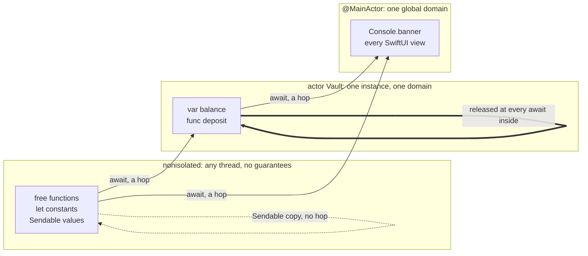

# 11. Sendable, Actors, and MainActor

## Cold open

Blank file, no notes: re-solve your chapter 09 drill on `CodingKeys` before
you read anything below.

```bash
swift test --package-path drills --filter Ch09
```

## The question

A data race is two accesses to one piece of memory from two threads, at least
one of them a write, with nothing ordering them. The result is not a wrong
answer you can debug. It is undefined behavior: a torn read, a crash three
functions away, a suite that is green on your machine and red once a month in
production.

Every other mainstream language treats that as a discipline problem. Hold the
right lock, document the threading contract, review carefully. Swift 6 treats
it as a type problem, and refuses to build a program where the race is
possible. The trade buys you a whole class of bug you will never ship. It
costs you diagnostics that read like a legal filing, and learning to read
them is most of this chapter.

## Swift's answer

Three ideas, in the order the compiler applies them.

**`Sendable` is the type level claim that a value is safe to hand to another
isolation domain.** It is a marker protocol with no requirements, so nothing
is implemented to conform. A struct or enum whose stored parts are all
`Sendable` gets it for free, because handing over a copy shares no storage.
That is the concurrency dividend chapter 03 promised for value semantics.

```swift
struct Waybill: Sendable { var stops: [String]; var weight: Int }  // free
final class Tripmeter { var miles = 0 }                             // never
```

A class is the opposite case. Two references to one `Tripmeter` are two names
for one mutable box, so sending it hands a second domain a write it cannot
order against yours. A class qualifies only by being `final` with every stored
property immutable and `Sendable`, or by taking the `@unchecked Sendable`
escape hatch, which is you promising a lock the compiler cannot see. Closures
carry the rule under a different spelling: a `@Sendable` closure may capture
`Sendable` values only.

**An `actor` is a reference type that owns an isolation domain.** Its stored
properties are reachable only from inside, so the compiler, not a lock,
guarantees serial access.

```swift
actor Vault {
    var balance = 0
    nonisolated let code: String

    init(code: String) { self.code = code }

    func deposit(_ amount: Int) { balance += amount }
    func peek() -> Int { balance }
}
```

Inside the actor, `deposit` and `peek` are ordinary synchronous calls, because
you are already in the domain. Outside, they are `await`ed, and the `await` is
the hop into it. `code` is `nonisolated`: it can never change, so protecting
it serializes nothing. Actors are implicitly `Sendable`, so passing one around
is free.

That `await` is not a lock acquisition, and reading it as one is the single
most expensive mistake available here. An actor is released at every
suspension point inside its own methods, so while your method is parked at an
`await`, another message runs to completion against the same state. That is
reentrancy, and it is deliberate: a lock held across an `await` is a deadlock
waiting for a slow network.

```bash
make probe CH=11 P=reentrancy
```

That probe is a cache that checks, misses, awaits a fetch, and stores. It
fetches twice for one key, with no threads and no timing involved. Every
invariant an isolated method depends on has to hold at every `await` inside
it, because the actor is open for business while you wait.

**`@MainActor` is a global actor**, a singleton domain rather than a per
instance one. On a type it isolates every member; `nonisolated` on one member
takes that member back out.

```swift
@MainActor
final class Console {
    var banner = ""
    nonisolated func describe() -> String { "console" }
}
```

Last, the rule that makes all of this livable. Swift does not actually require
`Sendable` to cross a boundary. It tracks **regions**: sets of values that
could reach each other. A region nobody else can reach may be transferred
whole, non `Sendable` contents and all, and the sender is then forbidden from
touching it again. `sending` is that promise written on a parameter.

```bash
make probe CH=11 P=regions
```

## Predict

Write your prediction in the comment above each `print`, then run the file.
The toolchain is the answer key, and no answer key lives in this repository.
Snippet 3 is the reentrancy question again, asked as a number.

```bash
make probe CH=11 P=predict
```

## Coming from C#

### Where the analogy holds

| C# | Swift | Note |
|---|---|---|
| a data race is undefined behavior | same | The definition did not change, only who is responsible for finding it. |
| `lock (x) { }` around shared state | `actor` | Both serialize. One is a convention you can forget, the other is the type. |
| the UI thread | `@MainActor` | Same thread, same rule. Swift writes the rule in the signature. |

### Where it breaks

| C# | Swift | Why the reasoning differs |
|---|---|---|
| `SynchronizationContext` plus `ConfigureAwait(false)` | isolation declared on the declaration | C# resumes wherever ambient state says, and you opt out per await. Swift resumes where the type said, and you can read it without running anything. |
| `lock` is held across the whole body | an actor is released at every `await` | A `lock` blocks. An actor yields. Transferring the `lock` intuition is how you write the reentrancy bug. |
| thread safety is a doc comment | `Sendable` | A constraint the compiler checks, not a sentence in the XML docs. |
| `volatile`, `Interlocked`, a `ConcurrentDictionary` | pick an isolation domain | The C# toolkit makes one field safe at a time. Swift asks which domain owns the state, once. |

The habit to unlearn is not `async`, which transfers almost intact. It is the
belief that thread safety is achieved by adding something: a lock, a
concurrent collection, an `Interlocked.Increment`. In Swift it is achieved by
deciding where state lives and letting the compiler enforce that everything
else asks. If you find yourself reaching for a lock, the isolation is in the
wrong place.

Full row set: [docs/bridge.md](../../docs/bridge.md).

## The model



Three domains, and the arrows are the only legal traffic between them. A solid
arrow costs an `await` and a suspension. The dotted arrow is a `Sendable`
value moving with no boundary at all, which is why value types are the cheap
answer. The self loop is reentrancy: the actor admits the next message while
the current one is suspended.

## Where it goes wrong

Every row came from `probes/errors.swift` on the toolchain in the front
matter. Uncomment one block at a time. Rows 1 to 3 are `Sendable`, 4 to 6 are
isolation, row 7 is global state, and row 8 is regions.

| Diagnostic | What it means | Fix |
|---|---|---|
| `error: non-final class 'Tripmeter' cannot conform to 'Sendable'; use '@unchecked Sendable'` | A subclass could add mutable state, so the promise cannot bind. | Mark it `final`, or use a struct. |
| `error: stored property 'miles' of 'Sendable'-conforming class 'Tripmeter' is mutable` | `final` was not the problem. Anyone holding the reference can write it. | Make it `let`, or move the state into an actor. |
| `error: capture of 'tripmeter' with non-Sendable type 'Tripmeter' in a '@Sendable' closure [#SendableClosureCaptures]` | The closure carries its captures into another domain. | Capture the value you need, not the object holding it. |
| `error: actor-isolated property 'balance' can not be referenced from a nonisolated context` | The state belongs to the actor, and you are outside it. | Add a method on the actor and `await` it. |
| `error: actor-isolated instance method 'deposit' cannot be called from outside of the actor` | Same rule for methods. There is no synchronous path in. | `await v.deposit(5)` from an async context. |
| `error: main actor-isolated property 'banner' can not be mutated from a nonisolated context` | `@MainActor` on the type isolated every member of it. | `await MainActor.run { }`, or isolate the caller too. |
| `error: static property 'requestCount' is not concurrency-safe because it is nonisolated global shared mutable state [#MutableGlobalVariable]` | A global anyone can write is the original data race. | Make it a `let`, or isolate it to a global actor. |
| `error: sending 'tripmeter' risks causing data races [#SendingRisksDataRace]` with `note: 'tripmeter' used after being passed as a 'sending' parameter; Later uses could race` | The transfer was legal. The line after it was not, because you kept a way back into the region. | Stop using the value once you send it. |

## Exercises

Stubs are in `exercises/Exercises.swift`. Run them with
`swift test --filter Chapter11Tests`.

1. `SeatBook.reserve(_:)` and `bookedSeats()`: an actor that hands a seat to
   exactly one caller, case insensitively.
2. `GuardedLedger.withdraw(_:)`: withdraw, audit, never overdraw. The audit
   hook is `async`, so the actor is released while it runs, and the suite
   calls back into the ledger from inside it.
3. `Dashboard.show(_:)`, `recent(_:)`, and `tag()`: a `@MainActor` type with
   one member that steps out of the domain.
4. `ShipmentTracker.manifest()`: a `Sendable` snapshot of actor state, with
   distinct stops in first seen order.

<details><summary>Hint 1, a nudge</summary>

Exercise 1: `Set.insert` already returns the answer to "was this new".

Exercise 2 is the whole chapter in one method. Say out loud what has to be
true about `available` at the moment the audit hook runs, then look at where
your `await` sits relative to your arithmetic.
</details>

<details><summary>Hint 2, an approach</summary>

Exercise 2: the failing test withdraws again from inside the audit hook.
Nothing you write makes that second call wait, so your only lever is what the
state already says when it arrives.

Exercise 4: a `Set` answers "have I seen this" and destroys the order you were
asked for. You need both, so keep both.
</details>

<details><summary>Hint 3, the API to look up</summary>

`Set.insert(_:)` and its `inserted` result. `String.uppercased()`.
`Array.prefix(_:)` and `Array.reversed()`, and what `prefix` does when you ask
for more than there is. For exercise 4, `Array.contains(_:)`.
</details>

## Retrieval checkpoint

Answer in writing first, then run the code. Nothing here has a committed
answer.

1. `actor Vault { var balance = 0 }`. Why is `func peek() -> Int { balance }`
   synchronous inside and `await`ed outside? Name what the `await` waits for.
2. A `final class` of `let` properties is `Sendable`. Add one `var` and it is
   not. Say in one sentence why `final` was necessary but not sufficient.
3. Describe, without writing it, one change to `probes/reentrancy.swift` that
   makes the second fetch impossible. Then say what it does when the first
   fetch throws.
4. `@MainActor func a()` calls `nonisolated func b()` which calls
   `@MainActor func c()`. How many suspension points, and where?
5. Judgment, no single right answer. A non `Sendable` cache is used by one
   screen. Argue for an `actor`, then for `@MainActor`, then for leaving it
   alone, and name the fact about who touches it that decides.

## Stretch

Not required to advance. Skipping all of it costs you nothing.

- SE-0414, Region based isolation, which is why `probes/regions.swift`
  compiles:
  <https://github.com/swiftlang/swift-evolution/blob/main/proposals/0414-region-based-isolation.md>
- SE-0430, `sending` parameter and result values:
  <https://github.com/swiftlang/swift-evolution/blob/main/proposals/0430-transferring-parameters-and-results.md>
- Go back to [projects/05-event-bus](../../projects/05-event-bus/SPEC.md) and
  make the bus usable from more than one isolation domain. Note what could not
  be fixed without changing the public API.

## Done when

- [ ] `swift test --filter Chapter11Tests` is green
- [ ] Every diagnostic that cost more than ten minutes is in `NOTES/errors.md`
- [ ] I contributed this chapter's four drills to `drills/`
- [ ] I can explain the three concepts in the front matter out loud, no notes
- [ ] `make probe CH=11 P=reentrancy` prints a load count of two, and I can
      point at the line that lets the second one in

This chapter covers where work happens, never how long it takes. `async let`,
`TaskGroup`, the task tree, and cancellation are
[12-async-await](../12-async-await/README.md), and every term above is defined
in [docs/glossary.md](../../docs/glossary.md).
