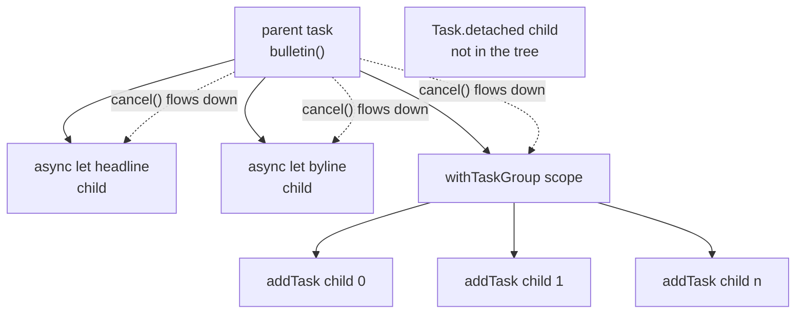

# 12. Structured Concurrency

## Cold open

Blank file, no reference. Re-solve your chapter 10 drill that breaks the
cycle between an object and the closure it stores, and say which side you
made weak.

```bash
swift test --package-path drills --filter Ch10
```

## The question

Most of what a program does while waiting is nothing. A thread parked on a
socket holds a stack and a scheduler slot and computes zero results, so the
first answer, one thread per wait, buys simplicity with the most expensive
resource on the machine. The callback answer costs no threads and wrecks the
shape of the code instead: a function that hands you its result through a
closure cannot return a value and cannot throw.

Suppose you fix both, so work suspends without holding a thread and still
reads top to bottom. One question is left, and it is the hard one. Who owns a
piece of running work, who must wait for it, and who may stop it.

## Swift's answer

`async` is part of a function's type, and `await` marks the exact points
where it can suspend.

```swift
func fetchHeadline() async -> String {
    try? await Task.sleep(for: .milliseconds(50))
    return "quiet week"
}
```

`await` is not a thread block. It is a yield: the function's state is parked,
the thread goes and runs something else, and the function resumes later,
possibly on a different thread. That is why it must be written at every call
site. Everything you knew before an `await` may be false after it, because
arbitrary other code ran in between.

Two waits that do not depend on each other should overlap, and `async let`
says so. The child starts at the declaration and the `await` is only where
you collect it.

```swift
func bulletin() async -> String {
    async let headline = fetchHeadline()
    async let byline = fetchByline()
    return "\(await headline), by \(await byline)"
}
```

Both children are bound to that function's body. Control cannot leave the
scope while a child is still running, on any path, including a thrown error.
That guarantee is what "structured" means, and it is enforced rather than
recommended.

When the number of children is not known until run time, `async let` cannot
express it, and a task group can.

```swift
func crawl(_ paths: [String]) async -> Int {
    await withTaskGroup(of: Int.self) { group in
        for path in paths {
            group.addTask { await weigh(path) }
        }
        var bytes = 0
        for await size in group {
            bytes += size
        }
        return bytes
    }
}
```

Results arrive in completion order, not submission order, and the closing
brace of `withTaskGroup` is a join. Use `withThrowingTaskGroup` and a child
that throws cancels its siblings and the error comes out of `next()`.

Cancellation is a flag and nothing more. `cancel()` sets it on a task and on
every task below it, then returns. No stack is unwound and no thread is
killed, because killing work at an arbitrary instruction is how you get a
half written file. Code that never asks keeps running to completion.

```swift
func poll(_ beacons: [String]) async throws -> [String] {
    var seen: [String] = []
    for beacon in beacons {
        try Task.checkCancellation()
        seen.append(await ping(beacon))
    }
    return seen
}
```

`Task.isCancelled` reads the flag, `Task.checkCancellation()` throws
`CancellationError` if it is set, and the standard library's suspending
calls, `Task.sleep` above all, already do this for you. Returning a partial
answer is as legitimate as throwing; what is not legitimate is ignoring it.

A stream of values over time is an `AsyncSequence`, consumed with
`for await`, and it is cancellation aware for free because iterating it
suspends. `AsyncStream` builds one out of a callback source, and
`withCheckedContinuation` bridges a single callback into a single `await`.
A continuation must be resumed exactly once, which no compiler checks:
[`probes/continuation.swift`](probes/continuation.swift) shows both ways to
get it wrong.

`Task { }` starts unstructured work with no parent to wait for it, which is
what you want at the boundary between synchronous code and async code, and
almost nowhere else. It still inherits isolation, priority, and task local
values from where it was written. `Task.detached { }` inherits none of those,
including the main actor, which is why a detached task that touches UI state
does not compile. Reach for it when you can write down why, and expect that
to be rare.

## Predict

Write your prediction on each `PREDICTION:` line in
[`probes/predict.swift`](probes/predict.swift), then run
`make probe CH=12 P=predict`. All three ask the same question: what does a new
task inherit from the task that made it.

```swift
let outer = Task { () -> (Bool, Bool) in
    let inner = Task { () -> Bool in
        try? await Task.sleep(for: .milliseconds(50))
        return Task.isCancelled
    }
    try? await Task.sleep(for: .milliseconds(50))
    return (Task.isCancelled, await inner.value)
}
outer.cancel()
print(await outer.value)                                   // 1
```

## Coming from C#

### Where the analogy holds

| C# | Swift | Note |
|---|---|---|
| `await` | `await` | both mark a suspension point rather than a thread block |
| async colouring | async colouring | a synchronous caller still cannot call an async function |
| `IAsyncEnumerable<T>` | `AsyncSequence` | `await foreach` becomes `for await` |
| `TaskCompletionSource<T>` | `withCheckedContinuation` | both bridge a callback into an awaited value |

### Where it breaks

The single most expensive assumption you can carry over is that these two
words name the same thing.

| Claim | C# `Task` | Swift `Task` |
|---|---|---|
| what it is | a promise the work already started producing, returned by the method | a handle to a task you created, and the unit the runtime schedules |
| how you usually get one | every `async` method returns one | you almost never make one; `async let` and groups make children for you |
| blocking on it | `.Result`, `.Wait()`, `GetAwaiter().GetResult()` | nothing. Reading `.value` is an `await` |
| lifetime | unowned; nothing waits for it unless you do | a child cannot outlive the scope that made it |
| cancellation | a `CancellationToken` you thread through every signature | ambient on the task, and it propagates down the tree |
| one failure of many | `Task.WhenAll` runs the rest regardless | a throwing group cancels the siblings |

A C# `async` method returns a `Task` because the method is the unit of work.
In Swift the task is the unit of work and the method is a function that
suspends, so `async` shows up in the type and nothing is returned to hold.
`Task.Run` translates to `Task.detached`, and both are rare here.

Full row set: [docs/bridge.md](../../docs/bridge.md).

## The model



Every edge is a lifetime, so no scope returns while a child of it is still
running, and a `cancel()` anywhere is a flag set on that node and everything
under it. `Task.detached` has no edge, which is the whole objection to it:
nothing waits for it and nothing cancels it.
[`probes/tree.swift`](probes/tree.swift) prints all three behaviors with
timestamps.

## Where it goes wrong

Rows 1 through 7 are `make probe CH=12 P=errors`, uncommented one block at a
time. Row 8 is a run time trap, from `make probe CH=12 P=continuation`.

| Diagnostic | What it means | Fix |
|---|---|---|
| `error: 'async' call in a function that does not support concurrency` | async is part of the callee's type, and the caller is not async | make the caller async, or open a `Task { }` at the boundary |
| `error: expression is 'async' but is not marked with 'await'` | a suspension point must be visible at the call site | write `await`, and treat what you knew as stale after it |
| `error: 'async' property access in a function that does not support concurrency` | reading `.value` is itself an await, and there is no `.Result` | await it, or do not need the answer here |
| `error: for-in loop requires 'AsyncStream<Int>' to conform to 'Sequence'` | an async sequence needs a loop that can suspend | `for await value in stream` |
| `error: for-in loop requires '[Int]' to conform to 'AsyncSequence'` | `for await` is not a way to make an array concurrent | plain `for`, or a group if you want overlap |
| `error: passing closure as a 'sending' parameter risks causing data races between code in the current task and concurrent execution of the closure` | every child would be writing one captured variable | return a value per child, accumulate while draining |
| `error: main actor-isolated property 'title' can not be mutated from a nonisolated context` | a detached task inherits no isolation | use `Task { }`, which inherits it |
| `_Concurrency/CheckedContinuation.swift:172: Fatal error: SWIFT TASK CONTINUATION MISUSE: twice() tried to resume its continuation more than once, returning 2!` | exactly once, and no compiler checks it | resume on every path out of the callback, once |

## Exercises

Stubs are in `exercises/Concurrency.swift`, in the order below. Run
`swift test --filter Chapter12Tests`. `CallLog` and `StationFeed` are given,
and they let the suite ask how many calls overlapped, so a correct but
sequential answer still fails.

1. `stationSummary(for:from:)` reports one station's temperature and wind in
   about the time one of them takes.
2. `totalRainfall(across:from:)` totals a list whose length is known only at
   run time.
3. `collectSamples(count:from:)` returns what it has when cancelled, and
   never throws.
4. `currentPressure(from:)` bridges `LegacyBarometer`'s callback into an
   `await`.
5. `firstReading(above:in:)` takes the first match out of an `AsyncStream`.
6. `temperatures(for:from:)` fetches every station or throws. The integrative
   one: the suite checks that the failing station's siblings started and were
   then cancelled, which no sequential loop produces.

<details><summary>Hint 1, a nudge</summary>

Exercise 2 and exercise 6 are the same shape. The difference is what a child
returns: exercise 6 needs the station name back as well as the reading,
because results arrive in completion order.
</details>

<details><summary>Hint 2, an approach</summary>

For exercise 6, a child that returns a tuple lets the draining loop rebuild
the dictionary. For exercise 3, the cancellation check belongs before the
work, not after it, or you pay for one more read than you needed.
</details>

<details><summary>Hint 3, the API to look up</summary>

`withTaskGroup(of:)`, `withThrowingTaskGroup(of:)`, and that both groups are
themselves an `AsyncSequence` of their children's results. Then
`Task.isCancelled` and `withCheckedContinuation`.
</details>

## Retrieval checkpoint

Answer in writing first, then check the runnable ones. Nothing here has a
committed answer.

1. Name two things that can be different after an `await` that were true
   before it. Then say why that makes `await` a better place for a bug than
   a lock.
2. `async let a = f()` and `let a = await f()` on the same line of a function
   that then reads `a`. Predict the total elapsed time of each, given `f`
   takes 50ms, and check with `make probe CH=12 P=tree`.
3. A task group's child loops forever without ever reading
   `Task.isCancelled`. You cancel the parent. Predict what the parent's
   closing brace does.
4. Does `Task { }` inside a cancelled task start out cancelled? Predict, then
   run `make probe CH=12 P=predict`.
5. Judgment, no single right answer. You are given a callback API that
   sometimes calls its completion twice. Argue for wrapping it in
   `withCheckedContinuation` plus a guard flag against fixing the callback
   API, and say what the option you rejected costs you.

## Stretch

Not required to advance. Skipping all of it costs you nothing.

- Read SE-0304, "Structured concurrency", in
  <https://github.com/swiftlang/swift-evolution/tree/main/proposals>. The
  rationale for the lifetime rule is the useful part.
- Build a stream as well as consume one, with `AsyncStream.makeStream(of:)`.
- Add a fourth section to `probes/tree.swift` that cancels a group from
  inside one of its own children with `group.cancelAll()`.

## Done when

- [ ] `swift test --filter Chapter12Tests` is green
- [ ] Every diagnostic that cost more than ten minutes is in `NOTES/errors.md`
- [ ] I contributed this chapter's four drills to `drills/`
- [ ] I can explain the three concepts in the front matter out loud, no notes
- [ ] No `Task.detached` survives in my solutions:
      `grep -n 'Task.detached' modules/12-async-await/exercises/*.swift` prints nothing

This chapter does not cover where isolation comes from, only that tasks
inherit it. `actor`, `@MainActor`, `nonisolated`, and `Sendable` belong to
chapter [11-isolation](../11-isolation/README.md), and the completion handler
shapes you will meet in older code are
[docs/legacy-swift.md](../../docs/legacy-swift.md) section 4.
