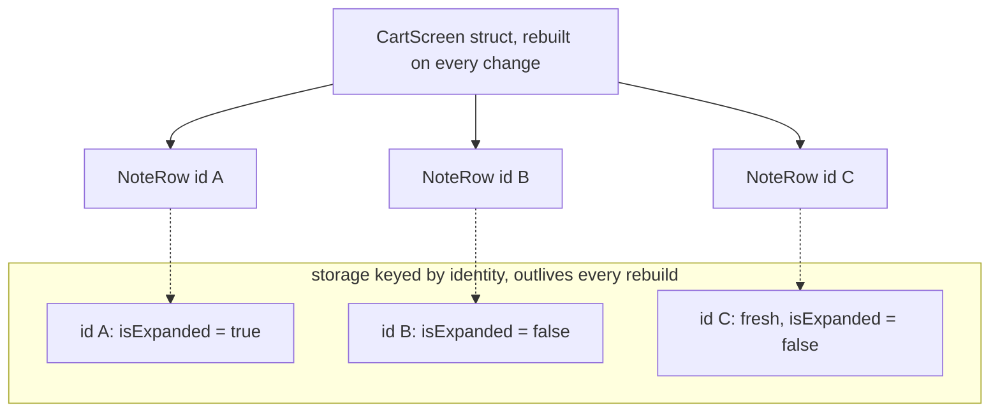

# 13. SwiftUI: Views, State, and Identity

## Cold open

Blank file, no reference. Re-solve your chapter 11 drill that isolates a
mutable counter to the main actor and reads it from a `nonisolated` function.

```bash
swift test --package-path drills --filter Ch11
```

## The question

A screen is a picture of some data. When the data changes the picture must
change with it, and every UI framework has to decide who writes that second
change. The imperative answer is that you do: you hold references to the
widgets and you mutate each one on every path that can alter the data, so
every screen bug is a mutation somebody forgot. The alternative is to
describe the picture as a pure function of the data and recompute it. That
answer is only affordable if recomputation is cheap, if something knows which
data was read, and if something can decide what counts as the same view
across two recomputations.

## Swift's answer

A `View` is a `struct`, and `body` is a nonmutating computed property. SwiftUI
builds that struct, reads `body`, keeps the resulting description, and throws
your struct away. When state changes it builds a new one. So a view value is a
short lived description, not an object you own, and it has to be cheap.

```swift
import SwiftUI

struct PressView: View {
    @State private var pressCount = 0

    var body: some View {
        Button("Pressed \(pressCount) times") { pressCount += 1 }
    }
}
```

`pressCount` cannot be a plain stored property, because the struct holding it
is discarded on the next update, and because `body` cannot mutate `self`.
`@State` asks SwiftUI to hold the value in its own storage, keyed by this
view's identity, and to reread `body` when it changes. Declare it `private`
always: nothing outside this view may own this view's state.

For anything larger than a value or two, the state is a model type, and the
model is a reference type so that every view holding it is looking at the same
instance rather than at a copy.

```swift
import Observation
import SwiftUI

@Observable
@MainActor
final class Cart {
    var items: [String] = []
    var isCheckingOut = false
}
```

`@Observable` is a macro. It rewrites each stored property into a computed one
whose getter calls `access(keyPath:)` and whose setter calls
`withMutation(keyPath:)` on an `ObservationRegistrar`. So `body` does not
subscribe to the model, it records which key paths it read, and a mutation
invalidates only the views that read that key path. Mutating `items` does not
disturb a view that only read `isCheckingOut`.

`@MainActor` is on the class because this state is read while the frame is
being built, and frames are built on the main actor. Chapter 11 made that a
type level fact rather than a rule in a comment, and this is where it pays.

```swift
struct CartScreen: View {
    @State private var cart = Cart()

    var body: some View {
        VStack {
            Text("\(cart.items.count) items")
            CheckoutToggle(cart: cart)
        }
    }
}
```

`@State` here owns the model's lifetime, not its value, and the boundary is
narrower than it first reads. The `@State` storage is created once per view
identity, and the instance in that storage is the one `body` sees on every
rebuild. The initializer expression `Cart()` is a different thing: it is
part of the view struct's own initializer, so it is evaluated every time the
struct is constructed. SwiftUI keeps the first result and throws the rest
away.

So "the initializer runs once" is the folk version and it is wrong. What runs
once is the storage allocation. `Cart()` runs every time the struct is
constructed, and every `Cart` after the first is built and immediately
discarded. That is why an
expensive or side effecting initializer inside `@State` is a real bug, and it
is what checkpoint question 2 is asking you to count.

The child takes the model directly, because passing a reference is already
sharing. It needs `@Bindable` only to project bindings out of it.

```swift
struct CheckoutToggle: View {
    @Bindable var cart: Cart

    var body: some View {
        Toggle("Checking out", isOn: $cart.isCheckingOut)
    }
}
```

| Tool | Owns the value | Correct when |
|---|---|---|
| `@State` | yes | this view creates the value and no ancestor needs it |
| `@Binding` | no | a child must write into an ancestor's value |
| `@Bindable` | no | you hold an `@Observable` model and need `$` bindings from it |
| `@Environment` | no | the value is provided further up and many views read it |

There is no fifth option and no `@State` copy of something an ancestor already
owns. Two stores of the same fact drift, and the bug arrives as a screen that
is correct until you navigate away.

Old tutorials will hand you a different set of names. They predate the
Observation macro, they are built on Combine, and they invalidate every reader
of the object whenever any `@Published` property changes.

| Combine era | Now | Why it is still everywhere |
|---|---|---|
| `ObservableObject` and `@Published` | `@Observable` | every SwiftUI post written before iOS 17 |
| `@StateObject` | `@State` | it was the only way to own a reference model |
| `@ObservedObject` | a plain property, or `@Bindable` | the old name for passing the model down |
| `@EnvironmentObject` | `@Environment(Cart.self)` | it needed no key type, so it read as simpler |

The full account, including what still compiles and what a real codebase will
look like, is in [docs/legacy-swift.md](../../docs/legacy-swift.md).

## Predict

Three blocks. Write your answer on the `PREDICT` line above each one, then run
the file. Nothing here imports SwiftUI, because `withObservationTracking` and a
hand rolled read and write pair are the whole mechanism, and both run on the
command line tools.

```bash
make probe CH=13 P=predict
```

```swift
withObservationTracking { _ = profile.name } onChange: { tally.fired += 1 }
profile.unreadCount = 7
profile.name = "ada"
profile.name = "grace"          // PREDICT: tally.fired is
```

```swift
let handle = Handle(read: { profile.name }, write: { profile.name = $0 })
var snapshot = profile.name
profile.name = "ada"
handle.write("grace")           // PREDICT: handle.read(), snapshot
```

```swift
let a = Profile()
let b = Profile()
b.name = a.name                 // PREDICT: a === b, a.name == b.name
```

## Coming from C#

WPF with MVVM is the closest model you have, and the mapping is closer than
you expect right up to the point where it inverts.

```csharp
public class CartViewModel : INotifyPropertyChanged {
    private bool _isCheckingOut;
    public bool IsCheckingOut {
        get => _isCheckingOut;
        set { _isCheckingOut = value; OnPropertyChanged(nameof(IsCheckingOut)); }
    }
}
```

### Where the analogy holds

| WPF | SwiftUI | Note |
|---|---|---|
| `INotifyPropertyChanged` | `@Observable` | both notify per property, and the macro writes the boilerplate |
| `Binding` in XAML, `TwoWay` | `Binding<Value>` and `$value` | both are a read and a write pair over storage elsewhere |
| `Dispatcher.CheckAccess` | `@MainActor` | Swift checks it at compile time, so there is nothing to assert |

### Where it breaks

| WPF | SwiftUI | Note |
|---|---|---|
| the visual tree is long lived and you mutate it | view structs are rebuilt and discarded | there is no widget to hold a reference to |
| `DataTemplate` reuse is a rendering detail | identity decides which state survives | a changed identity throws that row's state away |
| a `ViewModel` per view | one model, views own only their own state | a per view model is a layer that usually buys nothing |
| Python: `label.config(text=x)` in Tkinter | no equivalent exists | there is no widget handle and no update call to forget |

Full table: [docs/bridge.md](../../docs/bridge.md).

## The model



The structs on the bottom row are thrown away and rebuilt constantly. The
arena above them is not: an entry lives exactly as long as its identity is
present in the tree. Change a row's identity, by deriving it from a title or
from an array index, and its entry is discarded and rebuilt with the
initial value, which is why identity bugs read as state that resets itself.

## Where it goes wrong

Every row was reproduced from `probes/errors.swift`. The file compiles, with
each failing block commented out and its diagnostic pasted underneath, which
is the convention every chapter uses: a probe that stays green shows a stale
diagnostic as drift the next time you run it. Uncomment one block at a time
and read it yourself.

```bash
make probe CH=13 P=errors
```

| Diagnostic | What it means | Fix |
|---|---|---|
| `error: left side of mutating operator isn't mutable: 'self' is immutable` | you stored view state in the struct, and the struct is immutable during `body` | move it into `@State` |
| `error: cannot convert value 'name' of type 'String' to expected type 'Binding<String>', use wrapper instead` | the child declared `@Binding`, so it wants the projected value | pass `$name`, not `name` |
| `error: '@Observable' cannot be applied to struct type 'Preferences' (from macro 'Observable')` | observation is about one shared instance, and a struct is copied | make it a `final class`, or hold it in `@State` as a value |
| `error: 'init(wrappedValue:)' is unavailable: The wrapped value must be an object that conforms to Observable` | `@Bindable` projects bindings out of an observable model only | add `@Observable` to the class |
| `error: generic struct 'StateObject' requires that 'Cart' conform to 'ObservableObject'` | you mixed the Combine era wrapper with the modern macro | use `@State`, and delete `@StateObject` |
| `error: main actor-isolated property 'total' can not be referenced from a nonisolated context` | UI state is main actor isolated and the caller is not | make the caller `@MainActor`, or `await` it |
| `error: referencing initializer 'init(_:content:)' on 'ForEach' requires that 'Reminder' conform to 'Identifiable'` | SwiftUI never guesses identity | give the element a stored `id`, or pass `id:` |
| `error: cannot find '$theme' in scope` | `@Environment` reads a value it does not own, so it has no projection | own it with `@State` where it is provided |

## Exercises

Stubs are in `exercises/`, the suite is `swift test --filter Chapter13Tests`.

1. `TapCounter.tap()`, `reset()`, and `isAtLimit`. A model that enforces its own
   rule, so `count` is `private(set)` and only methods change it.
2. `Percent.binding(over:)`. Derive a `Binding<Int>` over a `Binding<Double>`
   that rounds and clamps on read and on write, and still writes through.
3. `ViewIdentity.freshIdentities(movingFrom:to:)`. The identities SwiftUI would
   build from scratch, which is a question about identity and never about
   contents.
4. `NoteStore.binding(forNoteWithID:)`. A binding into one element of the
   store's array that still finds the right note after the array is reordered.

<details>
<summary>Hint 1, a nudge</summary>

Exercise 4: what does your binding capture, and is that thing still true after
`notes.reverse()` runs?
</details>

<details>
<summary>Hint 2, an approach</summary>

A binding is two closures. Neither of them has to close over a position.
</details>

<details>
<summary>Hint 3, the API to look up</summary>

`Binding.init(get:set:)`, and `Collection.firstIndex(where:)`.
</details>

## Retrieval checkpoint

1. A view reads `cart.isCheckingOut` and nothing else. Someone appends to
   `cart.items`. Does `body` run again, and what mechanism decides?
2. `@State private var cart = Cart()` sits in a view that rebuilds sixty
   times a second. How many `Cart` instances exist after one second, and why?
3. Will a `struct` marked `@Observable` compile? Predict the diagnostic before
   you run it.
4. A row's `id` is its `title`. The user renames the row. Predict what happens
   to the text the row had in a `TextField`, and say why.
5. Judgment, written, no single right answer: a screen needs a search string, a
   sort order, and a list of loaded items. Which of those belong in `@State` on
   the view and which belong on the model, and what does the other choice cost?

## Stretch

Not required to advance.

- Dump what the macro actually writes:
  `swiftc -swift-version 6 -typecheck -Xfrontend -dump-macro-expansions probes/predict.swift`.
  Find `access(keyPath:)` and `withMutation(keyPath:)` in the output.
- Read SE-0258 Property Wrappers and SE-0382 Expression Macros, then say why
  `@State` is a wrapper and `@Observable` had to be a macro.
- Apple's [State](https://developer.apple.com/documentation/swiftui/state) and
  [Observation](https://developer.apple.com/documentation/observation)
  references, specifically what they say about identity and lifetime.

## Done when

- [ ] `swift test --filter Chapter13Tests` is green
- [ ] Every diagnostic that cost more than ten minutes is in `NOTES/errors.md`
- [ ] I contributed this chapter's four drills to `drills/`
- [ ] I can explain the three concepts in the front matter out loud, no notes
- [ ] I ran `preview-app/` in the iPhone 17 Pro simulator and watched a row
      lose its state when I changed how its identity was computed

This chapter does not cover navigation, dependency injection, or persistence.
Those are chapter 14. It also does not cover `ObservableObject` beyond
recognising it, which lives in `docs/legacy-swift.md`.
