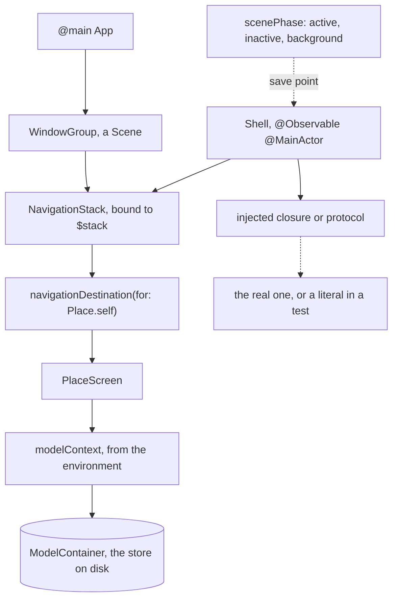

# 14. Navigation, Dependencies, and Persistence

## Before you start

This chapter needs full Xcode. The macro plugin that expands `@Model` ships
with Xcode and not with the Command Line Tools, so without this your first
SwiftData type fails on row 1 of the table below, in a message that names a
plugin rather than your code.

```bash
sudo xcode-select -s /Applications/Xcode.app
xcode-select -p
```

## Cold open

Blank file, no reference. Re-solve your chapter 12 drill that runs two child
tasks and cancels the group when the first one fails.

```bash
swift test --package-path drills --filter Ch12
```

## The question

A screen is a function of state, which chapter 13 settled. An app is three
further questions, and each has a cheap answer that survives until the app
gets real. Where am I, answered with a boolean per destination. Where did this
data come from, answered with a singleton the view grabs. Where does it live
between launches, answered with a file written on the way out.

All three fail the same way. The fact that matters is not in one place you can
name, so it cannot be restored, linked to, or tested without running the app
and looking at it.

## Swift's answer

An app is a `Scene` tree, not a view tree. `@main` names one `App` whose body
returns scenes, and a scene is a window's worth of content with a lifecycle.

```swift
@main
struct FieldNotesApp: App {
    @State private var shell = Shell()
    @Environment(\.scenePhase) private var phase

    var body: some Scene {
        WindowGroup {
            RootScreen().environment(shell)
        }
        .onChange(of: phase) { _, incoming in
            if incoming == .background { shell.flush() }
        }
    }
}
```

`scenePhase` is `.active`, `.inactive`, or `.background`, and the move to
`.background` is the last moment you are reliably alive. That is the save
point, because there is no callback for being killed.

Navigation is one value that you own.

```swift
enum Place: Hashable, Codable {
    case tag(String)
    case sighting(id: UUID)
}

struct RootScreen: View {
    @State private var stack: [Place] = []
    @State private var sheet: Modal?

    var body: some View {
        NavigationStack(path: $stack) {
            SightingsList()
                .navigationDestination(for: Place.self) { place in
                    PlaceScreen(place: place)
                }
        }
        .sheet(item: $sheet) { PlaceSheet(modal: $0) }
    }
}
```

`stack` is the whole of where you are. Appending pushes, removing pops,
assigning a three element array is a deep link, and writing it to disk is
state restoration. `navigationDestination(for:)` says how a `Place` becomes a
screen once, at the container, so a destination is built when it is reached
rather than when its row is drawn.

Sheets and covers are the same idea: `.sheet(item:)` takes an optional, so
presentation is a value being present rather than a `Bool` some other path can
flip out of step with what it was showing. Two booleans can both be true. One
optional cannot.

That is why value based navigation is testable and the older form is not.
`NavigationLink(destination:)` hands the framework a view, and a view is
neither `Equatable` nor `Codable`, so checking where a tap landed means
running the app and looking. A route is a value, so the assertion is
`router.path == [.tag("field")]` and it needs no simulator.

## Persistence, and the paragraph nobody writes

```swift
import SwiftData

@Model
final class Sighting {
    var caption: String
    var spottedAt: Date

    init(caption: String, spottedAt: Date) {
        self.caption = caption
        self.spottedAt = spottedAt
    }
}
```

`@Model` is a macro over a class, in the same family as `@Observable`: it
rewrites stored properties into tracked accessors and adds schema metadata.
`.modelContainer(for: Sighting.self)` on a scene opens the store and puts a
main actor `ModelContext`, the unit of work, in the environment. `@Query` is a
fetch that keeps the view current.

```swift
struct SightingsList: View {
    @Environment(\.modelContext) private var context
    @Query(sort: \Sighting.spottedAt, order: .reverse) private var newest: [Sighting]

    var body: some View {
        List(newest) { SightingRow(sighting: $0) }
    }
}
```

Keep `@Query` near the top of a view tree. It works in a deeply nested row,
and the price is a row that cannot be built without a store, which you find
out when you try to test it.

Now the honest paragraph. SwiftData migrates some changes silently: a new
model, a new optional property, a new property with a default. It does not
silently migrate a rename, a type change, or a new non optional property, and
the store it must migrate is the one already on your users' phones.
`VersionedSchema` and `SchemaMigrationPlan` describe the change, and the
release to write them for is the one before you needed them. A migration never
run against a copy of a real store is not a plan. The system this design
answers is [docs/core-data-literacy.md](../../docs/core-data-literacy.md).

## The seam

A model that reaches out for what it needs cannot be tested without whatever
it reached for. A model that is handed what it needs can.

```swift
@Observable
@MainActor
final class Shell {
    private let publish: @Sendable (Data) async throws -> URL

    init(publish: @escaping @Sendable (Data) async throws -> URL) {
        self.publish = publish
    }
}
```

Three tools, one rule each. A closure, or a small struct of closures, is the
default: it costs a line and the test passes a literal. A protocol earns its
keep when two real implementations exist, which is exactly storage, where a
SwiftData backed type and an in memory one both make sense. `@Environment`
carries a value down a subtree many views read.

The C# reflex is a protocol per dependency and a container that resolves them
at startup. Do not bring it. A container turns a compile time error into a run
time one, and thirty interfaces with one implementation each are thirty files
that exist so a framework can find them.

## MVVM, and what is actually true in 2026

What survives from MVVM is correct: a model type separate from the view,
holding the state and the rules, testable without a screen. Every exercise
here is that type.

What does not follow is one view model per view. Where the view is already a
value recomputed from state, a per view class forwarding six properties buys
nothing, and it is a layer you keep in sync.

`ObservableObject`, `@Published`, `@StateObject`, and `@ObservedObject` are
the Combine era mechanism for the same job. They compile, they invalidate
every reader of the object when any published property changes, and they are
in every tutorial older than iOS 17 and in most existing codebases.
Recognising them is a job requirement; writing new ones is not.
[docs/legacy-swift.md](../../docs/legacy-swift.md) is the full account.

Here is the paragraph, for when you are asked out loud. I keep state in
`@Observable` `@MainActor` model types that own their own rules, and views own
only the state nobody else needs, in `@State`. I do not write a view model per
view, because the view is already a function of state and the extra layer
mostly forwards. What I keep from MVVM is the separation: the model is
testable with no screen. In a codebase already on `ObservableObject` I match
the local style, because a half converted codebase is worse than either one.

## Accessibility, which is a requirement

A row that draws three views is three things VoiceOver reads separately, in
whatever order the layout produced.

```swift
SightingRow(sighting: sighting)
    .accessibilityElement(children: .ignore)
    .accessibilityLabel(RowLabel.spoken(for: stored, dueInDays: 2))
```

Three habits carry most of it. Compose one label per row. Use the semantic
fonts and `@ScaledMetric` rather than fixed sizes and fixed heights, then run
at the largest accessibility text size and see what clips. Turn VoiceOver on
and drive one flow. The label is a `String`, which is why exercise 5 is a test
rather than a modifier you either remembered or did not.

## Predict

Navigation state is data, so all of it answers on the command line. Write your
answer on each `PREDICT` line, then run it.

```bash
make probe CH=14 P=predict
```

## Coming from C#

### Where the analogy holds

| C# | Swift | Note |
|---|---|---|
| `Program.Main` | `@main` on an `App` | one entry point, named at compile time |
| `DbContext` | `ModelContext` | a unit of work that tracks changes and saves |
| an entity class plus attributes | `@Model` on a class | both add schema metadata to a plain type |
| constructor injection | a closure or protocol in `init` | still the default seam |

### Where it breaks

| C# | Swift | Note |
|---|---|---|
| a container resolves dependencies at startup | you pass them, or read `@Environment` | a miss is a compile error, not a startup one |
| LINQ builds an `Expression` tree at run time | `#Predicate` is built at compile time | a bad predicate does not compile |
| a `ViewModel` per view, on `INotifyPropertyChanged` | one `@Observable` model, `@State` for the rest | see the MVVM section |
| navigation is a `Frame` and a route table | navigation is a value you own | Python: no analogue |

A container exists because C# resolves dependencies by type at run time and
something must hold the map. Swift has no map. The seam is a parameter, so the
compiler checks it.

Full row set: [docs/bridge.md](../../docs/bridge.md).

## The model



One value decides what is on screen and one object owns it. Everything the
model cannot do itself arrives through the seam, so the same model runs
against a server and against a two line closure. The store sits at the bottom,
reached through the environment, and nothing above knows it is a database.

## Where it goes wrong

Every row was reproduced from `probes/errors.swift`, which compiles with each
failing block commented out and its diagnostic beneath.

```bash
make probe CH=14 P=errors
```

| Diagnostic | What it means | Fix |
|---|---|---|
| `error: external macro implementation type 'SwiftDataMacros.PersistentModelMacro' could not be found for macro 'Model()'; plugin for module 'SwiftDataMacros' not found` | the macro expanding `@Model` ships with Xcode | `sudo xcode-select -s /Applications/Xcode.app` |
| `error: type 'FieldNotesApp' does not conform to protocol 'App'` | an app's body is a `Scene`; a window is not a view | wrap it in `WindowGroup { }` |
| `error: instance method 'append' requires that 'SightingDetail' conform to 'Hashable'` | you pushed a view, and a path holds route values | append the route |
| `error: type 'Waypoint' does not conform to protocol 'Hashable'` | a route payload is as ordinary as the route | carry an id, not a model object |
| `error: instance method 'sheet(item:onDismiss:content:)' requires that 'Composer' conform to 'Identifiable'` | a sheet must know which sheet it is across a rebuild | conform it: `var id: Self { self }` |
| `error: referencing subscript 'subscript(_:)' on 'Binding' requires that 'NavigationPath' conform to 'MutableCollection'` | `NavigationPath` is type erased: a depth and a `Codable` form, no elements | use `[Route]` unless you mix types |
| `error: no exact matches in call to initializer` then `note: candidate requires that 'Almanac' conform to 'Observable'` | the environment carries only what a view can observe | add `@Observable` |
| ``warning: 'onChange(of:perform:)' was deprecated in macOS 14.0: Use `onChange` with a two or zero parameter action closure instead.`` | the one parameter closure every `scenePhase` article uses | take two parameters, or zero |

## Exercises

Stubs are in `exercises/`, the suite is `swift test --filter Chapter14Tests`.

1. `RoutePath.encode(_:)` and `decode(_:)`. Save a stack, get it back with
   its repeats, and land at the root when the bytes are not yours.
2. `AppRouter`. Push, pop, present, dismiss, and deep link as edits to one
   value. Popping at the root is the interesting case.
3. `EntryList.reload()`. An injected closure, four states, no network.
4. `NoteLibrary`. Filing, archiving, and the query a screen renders, over an
   injected storage protocol.
5. `RowLabel.spoken(for:dueInDays:)`. The sentence VoiceOver reads.

<details>
<summary>Hint 1, a nudge</summary>

Exercise 3: two of the end states come from the same successful call. What
tells them apart?
</details>

<details>
<summary>Hint 2, an approach</summary>

Exercise 1: decoding is the operation that meets bytes you did not write, so
it is the one that may not fail loudly. Exercise 4: filter, then sort, and
decide what the sort does when two keys are equal.
</details>

<details>
<summary>Hint 3, the APIs to look up</summary>

`JSONEncoder`, `JSONDecoder`, `try?`. `Array.popLast()`.
`String.range(of:options:)` and `String.CompareOptions.caseInsensitive`.
`Array.sorted(by:)` with a two key comparison.
</details>

## Retrieval checkpoint

1. A notification should land the user three screens deep. Write what your
   router does in one line, and say why that line is also a test.
2. `.sheet(isPresented:)` against `.sheet(item:)`. Name the bug the second
   makes impossible.
3. You add a non optional `var kind: String` to a shipped `@Model` class.
   Predict what happens on a device holding last week's store.
4. A view reads `@Query` three levels down. Name two things that get harder,
   and which you notice first.
5. Judgment, no single right answer. Argue a closure for a photo picker, then
   a protocol, then say which you ship and what the other one costs.

## Done when

- [ ] `swift test --filter Chapter14Tests` is green
- [ ] Every diagnostic that cost more than ten minutes is in `NOTES/errors.md`
- [ ] I contributed this chapter's four drills to `drills/`
- [ ] I can explain the three concepts in the front matter out loud, no notes
- [ ] I built [preview-app/](preview-app/README.md), backgrounded it two
      screens deep, relaunched, and know whether I landed where I was
- [ ] I ran one flow with VoiceOver on, at the largest accessibility text size

Getting a signed build onto a phone is
[docs/shipping.md](../../docs/shipping.md), a capstone gate rather than a
chapter one.
